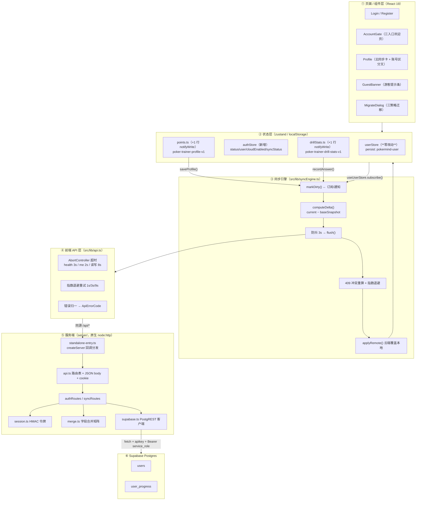
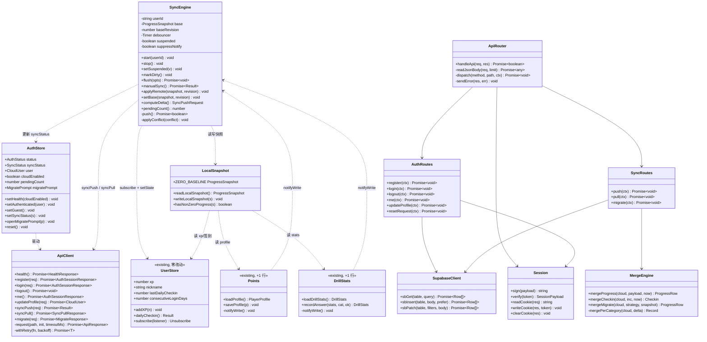
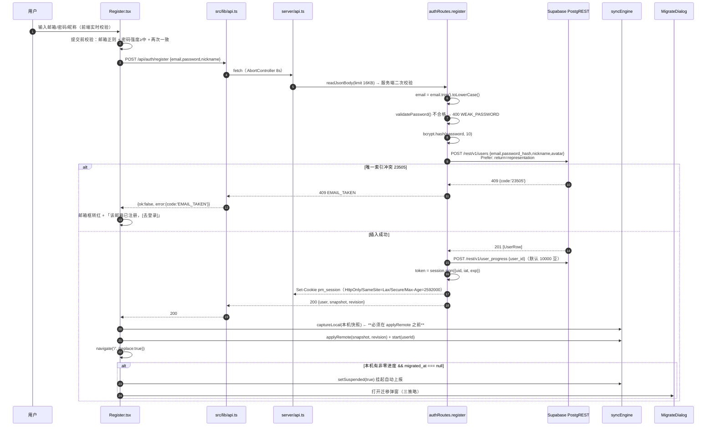
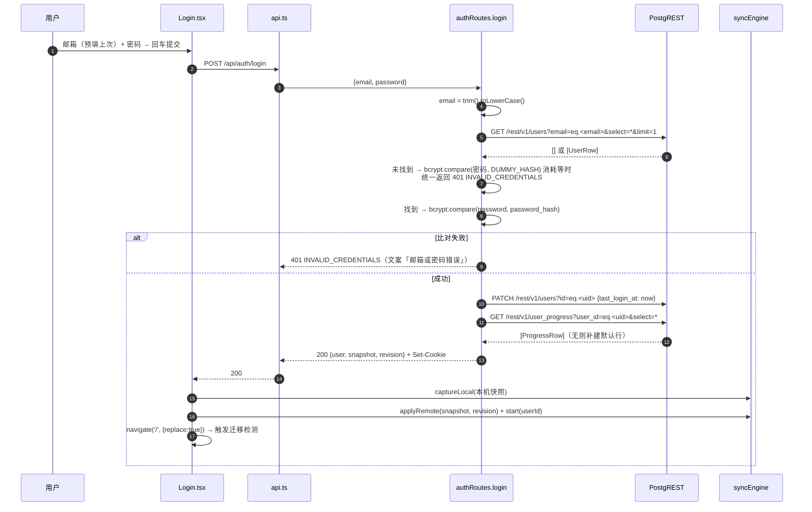
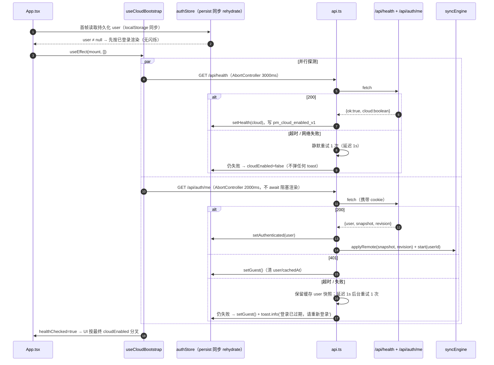
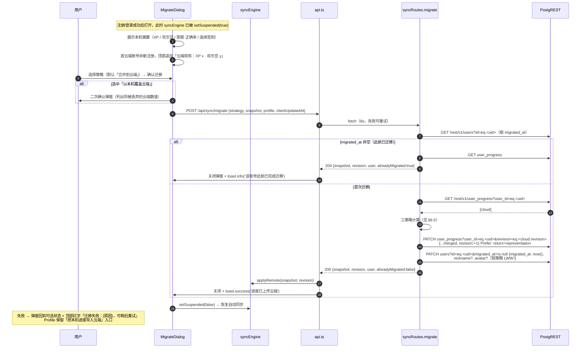
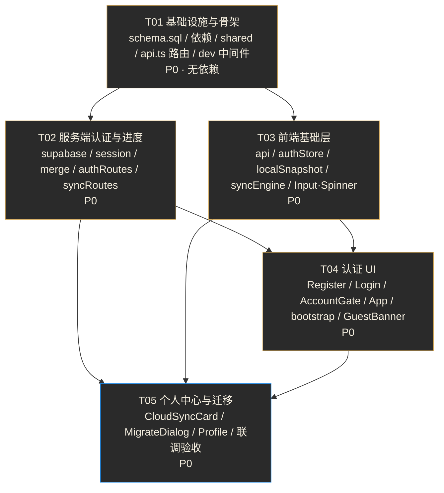

# ARCH｜poker-trainer 云端账号与同步系统 · 架构设计与任务分解

| 项目信息 | 内容 |
| --- | --- |
| Language | 简体中文 |
| 文档类型 | 架构设计 + 任务分解（系统设计的实现依据） |
| Project Name | `poker-trainer` |
| 上游文档 | `docs/PRD-账号系统.md`（许清楚，v1.0）—— 本文件不重写需求，只做技术设计 |
| 配套产物 | `supabase/schema.sql`（可执行 DDL）、`docs/class-diagram.mermaid`、`docs/sequence-diagram.mermaid` |
| 设计基线 | React 19 + Vite 7 + TS 5.9 + Tailwind 3 + zustand 5；服务端原生 `node:http` + esbuild |
| 文档版本 | v1.0 |
| 作者 | 高见远（架构师） |
| 执行者 | 寇豆码（工程师） |

---

## 0. 读码核对结论（架构决策的事实依据）

我已实地读完 PRD 点名的全部文件，以下是与文档描述**有出入或需要补充**的地方，架构据此调整：

| # | 核对项 | 实际结论 | 对设计的影响 |
| --- | --- | --- | --- |
| F1 | `points.ts` 写入点 | 全仓仅 `saveProfile()` **一处**写 localStorage（`claimRelief` 只返回新对象不落盘，调用方再调 `saveProfile`） | 只需在 `saveProfile` 加 1 行 `notifyWrite()`，无需 `commitProfile(mutator)` 包装器 |
| F2 | `drillStats.ts` 写入点 | 全仓仅 `recordAnswer()` **一处**写 localStorage | 同上，1 行改动即可 |
| F3 | 9 个调用方 | `Home / PokerTrainer / Blackjack / Drills / FriendRoom / Guandan / TrainingHub / Profile / Header` 确认无误 | 全部**零改动**，因为导出签名不变 |
| F4 | `userStore` | zustand + persist（`localStorage`，同步 rehydrate）；`setActivePatch` 在无 `activeId` 时只写顶层镜像字段 | 可通过 `useUserStore.subscribe()` 从外部挂载，**`userStore.ts` 一个字符都不用改**（超额满足 NFR-04） |
| F5 | `activeId=null` 的副作用 | 仅 `Profile.tsx:51` 的 `updateAccount(activeId!, ...)` 会静默失效 | 需给 Profile 的 `saveName` 加一个 `activeId ? A : setNickname()` 分支（唯一必须改的调用点） |
| F6 | Vite dev 无 `/api` | `vite.config.ts` 只挂了 `/ws`，**没有任何 `/api` 路由或代理** | 必须新增 Vite 中间件插件，否则本地联调 404 |
| F7 | `vite.config.ts: base: './'` | 资源用相对路径 | 前端 API 仍用**绝对路径** `/api/...`（同源），不受 base 影响 |
| F8 | `tsconfig` 分工 | `tsconfig.app.json` include 仅 `src`；`tsconfig.node.json` include 仅 `vite.config.ts`（`server/rooms.ts` 因被 vite.config import 而顺带纳入） | `server/` 目前**不参与 `npm run build` 的 `tsc -b`**。本设计把 `server` 纳入类型检查（见 §8.1），并提供本地 `npm run typecheck` |
| F9 | `common/` 组件 | 只有 `Button / Header / LevelBadge / LoadingScreen / Modal / PageHeader / Toast`——**没有 Input、没有 Spinner** | 需新增 `common/Input.tsx` 与 `common/Spinner.tsx`（`ui/input.tsx` 是 shadcn 白底风格，与暗金体系冲突，不可直接用） |
| F10 | `Button` 缺 loading | `ButtonProps` 无 `loading` 字段 | 给 `common/Button.tsx` 加一个可选的 `loading?: boolean`（纯增量，向后兼容） |
| F11 | `Modal` 无 `dismissible` | 遮罩点击即 `onClose` | 迁移弹窗执行中需禁止关闭 → 给 `Modal` 加可选 `dismissible?: boolean` |
| F12 | 冷启动真实影响面 | Render 冷启动 30–60s 主要卡在**首个 HTML/JS 请求**；等 React 挂载后再发 `/api/health` 时服务已热 | `/api/health` 实际几乎不会超时。但**仍按 PRD 保留 2s/3s 超时 + 后台重试**，因为用户可能从后台切回标签页触发二次调用 |
| F13 | Render 免费层无持久盘 | `node:crypto` 无状态令牌是唯一可行方案；P1 限流 Map 重启即失效（PRD 已接受 best-effort） | 与选型一致 |
| F14 | `src/lib/avatar.ts` | `compressAvatar(file, maxSize=256)` 已存在，输出 WebP dataURL | 复用；P0 限制落库 ≤128KB，超了服务端 400 |

---

## 1. 实现方案概述

### 1.1 技术选型（已拍板，本节只记录结论与校验方式）

| 关注点 | 选定方案 | 关键理由 / 校验方式 |
| --- | --- | --- |
| 认证 | 自建 `users` 表 + 服务端 `bcryptjs`（cost=10） | 纯 JS，无 node-gyp，Render 构建不会因编译原生模块失败 |
| DB 访问 | **原生 `fetch` 调 Supabase PostgREST**，不引入 `@supabase/supabase-js` | ① 零新增依赖；② esbuild 打包无坑（`supabase-js` 依赖 `cross-fetch`/`ws` 等，在 `--platform=node --format=esm` 下易踩 `require is not defined`）；③ 我们只需要 6 个 REST 动作，`fetch` 足够。**校验方式**：`npm run build:server` 后 `node -e "import('./dist-server/server.mjs')"` 能启动即可证明打包无坑 |
| 会话 | `node:crypto` HMAC-SHA256 无状态令牌 + httpOnly cookie `pm_session` | 严禁内存 session（Render 重启/冷启动即丢） |
| 并发控制 | PostgREST **条件 PATCH** 实现 CAS：`PATCH /rest/v1/user_progress?user_id=eq.X&revision=eq.N` + `Prefer: return=representation`；返回空数组 = 冲突 | Postgres `UPDATE ... WHERE revision=N` 在 READ COMMITTED 下会**重新求值 WHERE**，并发第二个事务匹配 0 行 → 天然原子 CAS，无需事务/RPC |
| 找回密码 | P1 只留路由返回 501 | 不引入邮件服务 |
| 多设备 | 允许同时在线，增量合并 + `revision` 乐观锁 | 与 PRD Q4 一致 |

### 1.2 分层架构图



### 1.3 数据流（一句话版）

```
写：页面 → points.saveProfile() / drillStats.recordAnswer() / userStore action
     → syncEngine.markDirty() → 防抖 3s → computeDelta(current − base)
     → POST /api/sync/push{baseRevision, delta, peak, perCategoryDelta, checkin, lww}
     → 服务端 merge.ts 按矩阵合并 → PostgREST CAS PATCH
     → 200 {snapshot, revision} → base := snapshot（delta 归零）
     → 409 → 本地镜像合并后更新 base := 云端快照，保留自身 delta，退避重试

读：App 挂载 → 并行 GET /api/health(3s) + GET /api/auth/me(2s，不阻塞首屏)
     → 200 → applyRemote(progress) 写入三源 + base := progress
     → 401 / 超时 → 游客态（用 pm_auth_cache_v1 的 user 快照先渲染，防闪烁）
```

### 1.4 关键架构决策（含理由，工程师不要改）

| 决策 | 理由 |
| --- | --- |
| **不引入 `@supabase/supabase-js`** | 见 §1.1 校验方式。我们只需要 `select / insert / patch / eq filter`，`fetch` 20 行搞定 |
| **合并逻辑写在 TS（`server/merge.ts`），不写 SQL RPC** | ① 改合并矩阵不用在 Supabase 面板跑迁移；② 可用 `node --test` 单测；③ CAS 条件 PATCH 已保证原子性。代价：push 多 1 次读往返（约 +150~300ms），但 push 是防抖后的后台行为，不阻塞任何交互 |
| **不新增「离线队列」数据结构** | delta = `当前本地值 − base`。base 持久化在 localStorage，因此**离线 N 天后的全部增量天然就是队列**，刷新/掉电都不丢（SYNC-07 的持久化诉求免费达成） |
| **`userStore.ts` 零改动** | 用 `useUserStore.subscribe()` 外部挂载。对比"改 store 内部"：风险更低、diff 更干净、NFR-04 超额满足 |
| **昵称/头像不走 sync/push，走独立的 `PUT /api/profile`** | 头像 dataURL ≤128KB，若混入 push 会撑爆 NFR-06 的「单次 payload < 8KB」。拆出去后 push payload 实测约 1~2KB |
| **`shared/` 目录放纯常量与校验函数** | 前后端共用邮箱正则、密码规则、字段合并分类表、ZERO_BASELINE，杜绝两处漂移。纯 TS 无依赖，Vite 与 esbuild 都能直接打 |

---

## 2. 文件清单

### 2.1 新增文件（19 个）

| # | 路径 | 职责 | 预估量 |
| --- | --- | --- | --- |
| 1 | `shared/constants.ts` | 错误码、字段合并分类表（ACCUM/PEAK/LWW/CHECKIN）、ZERO_BASELINE、限额（头像 128KB、payload 上限、超时时长、退避序列） | 小（~120 行） |
| 2 | `shared/validators.ts` | `isValidEmail()` / `validatePassword()` / `calcPasswordStrength()` / 昵称校验，前后端共用 | 小（~90 行） |
| 3 | `src/types/cloud.ts` | 前后端共享的**纯类型**契约：`ProgressSnapshot`、`CloudUser`、`ApiResponse<T>`、各 API 的 request/response | 小（~160 行） |
| 4 | `src/lib/api.ts` | `fetch` 封装：AbortController 超时、指数退避、错误归一、统一 `credentials:'include'` | 中（~180 行） |
| 5 | `src/store/authStore.ts` | 会话态 zustand：`status / user / cloudEnabled / syncStatus / lastSyncedAt / pendingCount` + actions | 中（~150 行） |
| 6 | `src/store/localSnapshot.ts` | 三源读写中枢：`readLocalSnapshot()`（userStore+points+drillStats → ProgressSnapshot）、`writeLocalSnapshot()`、`ZERO_BASELINE` 工具 | 中（~130 行） |
| 7 | `src/lib/syncEngine.ts` | 同步引擎：base 装载/持久化、delta 计算、防抖、flush、409 重算重试、applyRemote、suppress 抑制 | 大（~300 行） |
| 8 | `src/hooks/useCloudBootstrap.ts` | App 挂载时并行 `health` + `me`，驱动 authStore 与 syncEngine 启停 | 中（~110 行） |
| 9 | `src/components/common/Input.tsx` | 暗金风格输入框（48px、error 态、右侧插槽 44×44） | 小（~70 行） |
| 10 | `src/components/common/Spinner.tsx` | 金色旋转指示器（复用 `animate-spin` + gold 描边） | 小（~20 行） |
| 11 | `src/components/GuestBanner.tsx` | UI-04 游客提示条（通栏 44px、可关、对局页隐藏） | 小（~70 行） |
| 12 | `src/components/CloudSyncCard.tsx` | UI-03 云同步状态卡（已同步/同步中/离线/不可用 四态） | 中（~120 行） |
| 13 | `src/components/MigrateDialog.tsx` | UI-05 迁移引导弹窗（本机摘要 + 三策略 + 二次确认） | 大（~220 行） |
| 14 | `src/pages/Register.tsx` | UI-01 注册页 | 大（~260 行） |
| 15 | `src/pages/Login.tsx` | UI-02 登录页 | 中（~180 行） |
| 16 | `server/config.ts` | 读环境变量，导出 `CLOUD_ENABLED`、`SUPABASE_URL`、`SERVICE_ROLE_KEY`、`SESSION_SECRET` | 小（~40 行） |
| 17 | `server/errors.ts` | `HttpError` 类 + `sendJson()` + 错误码→HTTP 状态映射表 | 小（~80 行） |
| 18 | `server/supabase.ts` | PostgREST 客户端：`sbGet / sbInsert / sbPatch`（含 CAS 与 `Prefer` 头） | 中（~130 行） |
| 19 | `server/session.ts` | HMAC 令牌签发/校验（`timingSafeEqual`）+ cookie 读写 | 中（~110 行） |
| 20 | `server/merge.ts` | 字段合并矩阵（增量累加 / max / LWW / 签到重算 / perCategory）+ 防御性 clamp | 大（~200 行） |
| 21 | `server/authRoutes.ts` | register / login / logout / me / profile / password(P1) / reset(P1 501) / account(P1) | 大（~320 行） |
| 22 | `server/syncRoutes.ts` | push（含 CAS 409）/ pull / migrate（含三策略与幂等） | 大（~280 行） |
| 23 | `server/api.ts` | `/api/*` 路由分发 + JSON body 解析（分路径大小限制）+ 统一错误响应 + `handleApi()` 导出 | 中（~180 行） |
| 24 | `server/dev-api-plugin.ts` | Vite dev 中间件（`configureServer`），把 `handleApi` 挂到 Vite dev server 同端口 | 小（~40 行） |
| 25 | `supabase/schema.sql` | 建表 + 索引 + 约束 + RLS 说明 + P1/P2 预留表 | 已完成（见仓库） |
| 26 | `.env.example` | 只写键名不写值 | 小（~12 行） |

### 2.2 修改文件（10 个）

| # | 路径 | 改什么 | 预估量 |
| --- | --- | --- | --- |
| M1 | `src/store/points.ts` | `saveProfile()` 内 `localStorage.setItem` 之后加 1 行 `notifyWrite()`；**导出签名、字段名、默认值全部不变** | **小（+3 行）** |
| M2 | `src/store/drillStats.ts` | `recordAnswer()` 内 `localStorage.setItem` 之后加 1 行 `notifyWrite()`；同上 | **小（+3 行）** |
| M3 | `src/App.tsx` | ① 新增 `/login`、`/register` 路由；② 放行逻辑由 `!activeId` 改为 PRD §6.6 的三条件；③ 挂载 `useCloudBootstrap()`；④ `<GuestBanner />` 置于 `Routes` 之上并按 pathname 隐藏；⑤ `<MigrateDialog />` 全局挂载 | 中（~60 行改动） |
| M4 | `src/components/AccountGate.tsx` | 从"账号列表/创建"改为三入口欢迎页（游客进入 / 登录 / 注册），`cloudEnabled=false` 时隐藏前两者 | 中（~120 行重写） |
| M5 | `src/pages/Profile.tsx` | ① 段位卡与战绩卡之间插入 `<CloudSyncCard />`；② 账号区按登录态三分支；③ `saveName` 兼容 `activeId===null`；④ 挂 `MigrateDialog` 入口；⑤ 底部文案按云状态变化 | 大（~150 行改动） |
| M6 | `src/components/common/Button.tsx` | 追加可选 `loading?: boolean`（渲染 Spinner 并 disabled） | 小（+8 行） |
| M7 | `src/components/common/Modal.tsx` | 追加可选 `dismissible?: boolean = true`（false 时遮罩点击/关闭按钮失效） | 小（+6 行） |
| M8 | `vite.config.ts` | 引入 `apiPlugin()` 到 `plugins` 数组 | 小（+2 行） |
| M9 | `render.yaml` | 新增 `SUPABASE_URL` / `SUPABASE_SERVICE_ROLE_KEY`（`sync:false`）、`SESSION_SECRET`（`generateValue:true`）、`healthCheckPath: /api/health`、`NODE_VERSION` | 小（+12 行） |
| M10 | `.gitignore` | 追加 `.env*` 与 `!.env.example` | 小（+4 行） |
| M11 | `package.json` | 新增 `bcryptjs@^3.0.3`（**不要** `@types/bcryptjs`，是废弃 stub）；新增 `typecheck` / `dev:server` / `check:secrets` 脚本与 `engines` | 小（+8 行） |
| M12 | `tsconfig.node.json` | `include` 追加 `"server"`、`"shared"` | 小（+2 行） |

### 2.3 明确**不改动**的文件

```
src/store/userStore.ts                 ← 零改动（NFR-04 硬要求，用 subscribe 挂载）
src/pages/{Home,PokerTrainer,Blackjack,Drills,TrainingHub,FriendRoom,Guandan}.tsx
src/components/common/Header.tsx
server/rooms.ts                        ← 好友房逻辑
src/ai/**、src/lib/level.ts            ← 玩法与段位推导
```
> `FriendRoom.tsx` 的昵称来源（localStorage `poker-trainer-nickname`）**本次不动**。PRD §0.2 提到"昵称来源改为云端优先"属 P1 优化，P0 保持现状可避免触碰好友房链路（G3 零破坏优先）。

---

## 3. 数据结构与接口定义

### 3.1 共享类型（`src/types/cloud.ts`，**纯 type，无任何运行时代码**）

```ts
// ============================================================
// src/types/cloud.ts —— 前后端唯一契约源
// ⚠️ 本文件只允许出现 interface / type，禁止 const / enum / class。
//    server/ 通过 `import type { ... } from '../src/types/cloud'` 引入，
//    esbuild 会 100% 擦除，不会把前端代码打进 server bundle。
// ============================================================

/* ---------- 通用响应包 ---------- */
export type ApiErrorCode =
  | 'INVALID_EMAIL' | 'WEAK_PASSWORD' | 'NICKNAME_INVALID'
  | 'EMAIL_TAKEN' | 'INVALID_CREDENTIALS' | 'UNAUTHORIZED'
  | 'WRONG_PASSWORD' | 'RATE_LIMITED'
  | 'CLOUD_DISABLED' | 'NOT_IMPLEMENTED'
  | 'REVISION_CONFLICT' | 'ALREADY_MIGRATED'
  | 'INVALID_JSON' | 'PAYLOAD_TOO_LARGE' | 'AVATAR_TOO_LARGE'
  | 'INTERNAL' | 'NETWORK' | 'TIMEOUT';

export interface ApiError { code: ApiErrorCode; message: string; details?: unknown }

export type ApiResponse<T> =
  | { ok: true; data: T }
  | { ok: false; error: ApiError };

/* ---------- 用户 ---------- */
/** 云端用户资料（**永不含 password_hash**） */
export interface CloudUser {
  id: string;                 // uuid
  email: string;              // 已 trim + lowercase
  nickname: string;           // ≤12 字符
  avatar: string;             // '/avatars/1.png' 或 dataURL
  createdAt: string;          // ISO
  updatedAt: string;          // ISO，昵称/头像 LWW 依据
  migratedAt: string | null;
  emailVerified: boolean;
}

/* ---------- 进度快照（14 个标量与 PRD §5.2 一一对应） ---------- */
export interface CategoryStat { answered: number; correct: number }

export interface ProgressSnapshot {
  // 增量累计型 ACCUM
  xp: number;
  points: number;
  handsPlayed: number;
  handsWon: number;
  totalProfit: number;
  excellentActions: number;
  mistakes: number;
  drillAnswered: number;
  drillCorrect: number;
  // 峰值型 PEAK
  biggestPot: number;
  drillBestStreak: number;
  // LWW 状态型
  drillStreak: number;
  // 签到型 CHECKIN
  lastDailyCheckin: number;       // ms epoch
  consecutiveLoginDays: number;
  // 分项正确数
  drillPerCategory: Record<string, CategoryStat>;
}

/* ---------- 同步：本地 → 云端 ---------- */
export type AccumField =
  | 'xp' | 'points' | 'handsPlayed' | 'handsWon' | 'totalProfit'
  | 'excellentActions' | 'mistakes' | 'drillAnswered' | 'drillCorrect';
export type PeakField = 'biggestPot' | 'drillBestStreak';

export interface SyncPushRequest {
  baseRevision: number;
  /** 仅提交**有变化**的累加字段的差值：current − base */
  delta: Partial<Record<AccumField, number>>;
  /** 仅提交**变大**了的峰值字段的本地绝对值 */
  peak: Partial<Record<PeakField, number>>;
  /** 仅提交有变化的分项差值 */
  perCategoryDelta: Record<string, Partial<CategoryStat>>;
  /** 仅当本地签到状态相对 base 有变化时提交 */
  checkin: { lastDailyCheckin: number; consecutiveLoginDays: number } | null;
  /** 仅当 drillStreak 相对 base 有变化时提交 */
  lww: { drillStreak: number; clientUpdatedAt: number } | null;
}

export interface SyncPushResponse {
  snapshot: ProgressSnapshot;   // 合并后的云端最新值
  revision: number;
}
/** 409 时的 data 载荷 */
export interface SyncConflictPayload {
  snapshot: ProgressSnapshot;   // 云端最新值
  revision: number;             // 云端最新 revision
}

export interface SyncPullResponse {
  user: CloudUser;
  snapshot: ProgressSnapshot;
  revision: number;
}

/* ---------- 迁移 ---------- */
export type MigrateStrategy = 'merge' | 'overwrite' | 'keep_cloud';

export interface MigrateRequest {
  strategy: MigrateStrategy;
  /** 本机全量快照（相对 ZERO_BASELINE） */
  snapshot: ProgressSnapshot;
  /** 本机昵称/头像，供 LWW 决策 */
  profile: { nickname: string; avatar: string };
  clientUpdatedAt: number;
}

export interface MigrateResponse {
  snapshot: ProgressSnapshot;
  revision: number;
  user: CloudUser;
  alreadyMigrated: boolean;     // true = 此前已迁移过，本次未做任何合并
}

/* ---------- 认证 ---------- */
export interface RegisterRequest { email: string; password: string; nickname?: string }
export interface LoginRequest { email: string; password: string }
export interface LogoutResponse { ok: true }

export interface AuthSessionResponse {
  user: CloudUser;
  snapshot: ProgressSnapshot;
  revision: number;
}

export interface UpdateProfileRequest { nickname?: string; avatar?: string }

/* ---------- 健康检查 ---------- */
export interface HealthResponse { ok: true; cloud: boolean; ts: number }
```

### 3.2 服务端内部类型（`server/`）

```ts
// server/types.ts（本文件不导出到前端）
import type { AccumField, PeakField, CategoryStat } from '../src/types/cloud';

/** users 表的行形状（snake_case，与 Postgres 完全一致） */
export interface UserRow {
  id: string;
  email: string;
  password_hash: string;
  nickname: string;
  avatar: string;
  created_at: string;
  updated_at: string;
  last_login_at: string | null;
  migrated_at: string | null;
  token_version: number;
  email_verified: boolean;
}

/** user_progress 表的行形状 */
export interface ProgressRow {
  user_id: string;
  xp: number;
  points: number;
  hands_played: number;
  hands_won: number;
  total_profit: number;
  excellent_actions: number;
  mistakes: number;
  drill_answered: number;
  drill_correct: number;
  biggest_pot: number;
  drill_best_streak: number;
  drill_streak: number;
  last_daily_checkin: number;
  consecutive_login_days: number;
  drill_per_category: Record<string, CategoryStat>;
  revision: number;
  client_updated_at: string;
  updated_at: string;
}

/** HMAC 会话令牌载荷（仅此三项，绝不含密码/邮箱） */
export interface SessionPayload {
  uid: string;   // users.id
  iat: number;   // 签发时间（秒）
  exp: number;   // 过期时间（秒），= iat + 30 天
}
```

### 3.3 前端 `authStore` 的 State 与 Actions

```ts
// src/store/authStore.ts
import { create } from 'zustand';
import { persist, createJSONStorage } from 'zustand/middleware';
import type { CloudUser } from '../types/cloud';

export type AuthStatus = 'unknown' | 'guest' | 'authenticated';
export type SyncStatus = 'idle' | 'syncing' | 'offline' | 'unavailable';

interface AuthState {
  /* ---- 内存态（不持久化）---- */
  status: AuthStatus;              // unknown = 首次判定未完成
  syncStatus: SyncStatus;
  lastSyncedAt: number | null;
  pendingCount: number;            // 待同步变更条数（UI「N 条待同步」）
  /** 云端不可用时的健康探测是否已结束 */
  healthChecked: boolean;

  /* ---- 持久化态（key: pm_auth_cache_v1）---- */
  user: CloudUser | null;          // 上次登录的用户快照（防首屏闪烁）
  cachedAt: number | null;
  cloudEnabled: boolean;           // 上次 /api/health 的结论，初值 true（乐观）

  /* ---- 迁移弹窗（内存）---- */
  migratePrompt: {
    open: boolean;
    email: string;
    localSnapshot: ProgressSnapshot;   // 认证成功瞬间抓的本机快照
    localProfile: { nickname: string; avatar: string };
    cloudSnapshot: ProgressSnapshot;
  } | null;
  capturedLocal: { snapshot: ProgressSnapshot; profile: { nickname: string; avatar: string } } | null;

  /* ---- Actions ---- */
  setHealth: (cloudEnabled: boolean) => void;
  setGuest: () => void;                                   // status='guest', user=null
  setAuthenticated: (u: CloudUser) => void;
  setSyncStatus: (s: SyncStatus) => void;
  markSynced: (n: number) => void;                        // lastSyncedAt=now, pendingCount=n
  setPending: (n: number) => void;
  openMigratePrompt: (p: NonNullable<AuthState['migratePrompt']>) => void;
  closeMigratePrompt: () => void;
  captureLocal: (c: NonNullable<AuthState['capturedLocal']>) => void;
  clearCapturedLocal: () => void;
  reset: () => void;                                      // 登出：清 user/cachedAt，保留 cloudEnabled
}
```

```ts
// 持久化配置（关键：只持久化 user / cachedAt / cloudEnabled 三项）
persist(..., {
  name: 'pm_auth_cache_v1',
  storage: createJSONStorage(() => localStorage),
  partialize: (s) => ({ user: s.user, cachedAt: s.cachedAt, cloudEnabled: s.cloudEnabled }),
})
```
> `localStorage` 存储是**同步**的，zustand 在 store 创建时即完成 rehydrate，因此首帧就能读到 `user`，满足 US-05 ③「不闪烁」。

### 3.4 `syncEngine` 核心接口

```ts
// src/lib/syncEngine.ts
import type { ProgressSnapshot, SyncPushRequest, SyncConflictPayload } from '../types/cloud';

export interface SyncEngineApi {
  /** 登录后调用：装载/校验 base，注册 userStore 订阅与页面生命周期监听 */
  start(userId: string): void;
  /** 登出后调用：注销监听、清 base、清定时器 */
  stop(): void;
  /** 迁移弹窗期间挂起自动上报（避免与 migrate 双重累加） */
  setSuspended(v: boolean): void;
  /** 由 points/drillStats/userStore 订阅调用；未登录或挂起时直接 return */
  markDirty(): void;
  /** 立即上报（防抖取消 + 立即 flush）。manual=true 时先 push 再 pull */
  flush(opts?: { reason?: string }): Promise<void>;
  /** 「立即同步」按钮：先 flush 把本地增量推上去，再 pull 拉云端覆盖本地 */
  manualSync(): Promise<{ ok: boolean; error?: string }>;
  /** 云端快照覆盖本地三源，并把 base 置为该快照（delta 归零）。内部 suppress 写入通知 */
  applyRemote(snapshot: ProgressSnapshot, revision: number): void;
  /** 仅更新 base（不碰本地数据），用于迁移完成后的基线对齐 */
  setBase(snapshot: ProgressSnapshot, revision: number): void;
  /** 当前是否有未同步变更 */
  hasPending(): boolean;
  /** 待同步条数（供 UI） */
  pendingCount(): number;
  /** 内部：计算 current − base */
  computeDelta(): SyncPushRequest | null;   // null = 无变化，无需上报
}
```

### 3.5 类图



---

## 4. 数据库 DDL

**完整可执行 SQL 见 `supabase/schema.sql`**（已落盘）。要点速查：

| 表 | 关键设计 |
| --- | --- |
| `public.users` | 11 列；`unique index on lower(email)`（大小写不敏感，AUTH-04 靠此约束触发 23505）；`CHECK char_length(nickname) BETWEEN 1 AND 12`；`CHECK email ~* 正则`（服务端双保险）；`token_version` / `email_verified` 为 P1/P2 预留 |
| `public.user_progress` | 14 个进度标量 + `drill_per_category jsonb` + `revision int8`（乐观锁）+ `client_updated_at`（`drill_streak` 的 LWW 依据）；`CHECK xp>=0`；`points` 默认 10000 且**不加**非负约束（允许负 delta 的中间态） |
| RLS | 两张主表 `ENABLE ROW LEVEL SECURITY` 且**不建任何 policy** → anon/authenticated 一律拒绝，仅 service_role 可访问 |
| 预留表 | `point_ledger`（P1 SYNC-09）、`password_resets`（P2 AUTH-14）已建，RLS 同样开启 |
| 刷新缓存 | 文件末尾 `notify pgrst, 'reload schema';` |

### 4.1 字段对照表（PRD §5 → DDL）

| PRD §5.2 字段 | DDL 列 | 合并类 | 备注 |
| --- | --- | --- | --- |
| `xp` | `xp int4` | ACCUM | 等级不存库，`src/lib/level.ts` 由 xp 推导 |
| `points` | `points int8 default 10000` | ACCUM | delta 可为负 |
| `hands_played` | `hands_played int4` | ACCUM | |
| `hands_won` | `hands_won int4` | ACCUM | clamp ≤ hands_played |
| `total_profit` | `total_profit int8` | ACCUM | 可为负 |
| `excellent_actions` | `excellent_actions int4` | ACCUM | |
| `mistakes` | `mistakes int4` | ACCUM | |
| `drill_answered` | `drill_answered int4` | ACCUM | |
| `drill_correct` | `drill_correct int4` | ACCUM | clamp ≤ drill_answered |
| `biggest_pot` | `biggest_pot int8` | PEAK | |
| `drill_best_streak` | `drill_best_streak int4` | PEAK | |
| `drill_streak` | `drill_streak int4` | LWW | 依据 `client_updated_at` |
| `last_daily_checkin` | `last_daily_checkin int8` | CHECKIN | ms epoch，取 max |
| `consecutive_login_days` | `consecutive_login_days int4` | CHECKIN | max + 服务端重算 |
| `drill_per_category` | `drill_per_category jsonb` | PER_CAT_ACCUM | 逐 key 增量累加 |
| `revision` | `revision int8` | — | 乐观锁 |
| — | `client_updated_at timestamptz` | — | **本设计新增**，LWW 依据（PRD 未列，见 §12-Q1） |

---

## 5. 关键流程时序图

### 5.1 注册（AUTH-01/04）



### 5.2 登录（AUTH-05）



### 5.3 会话恢复（AUTH-08，冷启动不阻塞首屏）



### 5.4 增量上报（含乐观锁 409 重试）

```mermaid
sequenceDiagram
    autonumber
    participant Page as 任意页面
    participant P as points.saveProfile / drillStats.recordAnswer
    participant SE as syncEngine
    participant API as api.ts
    participant SR as syncRoutes.push
    participant ME as merge.ts
    participant SB as PostgREST

    Page->>P: saveProfile({...p, points: p.points+20})
    P->>P: localStorage.setItem(...)
    P->>SE: notifyWrite() → markDirty()
    SE->>SE: clearTimeout(debouncer); debouncer = setTimeout(flush, 3000)
    Note over SE: 3s 内无新写入 → 触发 flush<br/>（或 visibilitychange→hidden / pagehide 时立即 flush）

    SE->>SE: payload = computeDelta()  // current − base
    alt payload 无任何变化
        SE->>SE: 直接 return（不发请求）
    end
    SE->>API: POST /api/sync/push {baseRevision, delta, peak, ...}
    API->>SR: fetch（AbortController 8000ms）
    SR->>SR: session.verify(cookie) → 401 UNAUTHORIZED
    alt CLOUD_ENABLED === false
        SR-->>API: 503 CLOUD_DISABLED
        API->>SE: 静默 → syncStatus='unavailable'
    end
    SR->>SB: GET /rest/v1/user_progress?user_id=eq.<uid>
    SB-->>SR: [ProgressRow]
    alt cloud.revision ≠ payload.baseRevision
        SR-->>API: 409 REVISION_CONFLICT + {snapshot, revision}
        API->>SE: 冲突
        SE->>SE: merged = merge(cloudSnapshot, 我的 delta)<br/>writeLocalSnapshot(merged)（suppress 通知）
        SE->>SE: base := cloudSnapshot; baseRevision := cloud.revision
        Note over SE: ⚠️ delta 保持不变（是我自己未入库的增量）<br/>只换基准，不重算为 (local − cloud)
        SE->>SE: await sleep(300) → 第 1 次重试
        SE->>API: POST /api/sync/push（新 baseRevision，同 delta）
        Note over SE: 仍 409 → 再退避 900ms 重试 1 次；<br/>共 2 次重试后放弃 → syncStatus='offline'，增量留待下次
    else revision 匹配
        SR->>ME: mergeProgress(cloudRow, payload, now)
        ME->>ME: ACCUM: cloud + delta；PEAK: max；perCategory 逐 key 累加<br/>CHECKIN: max + 重算；LWW: clientUpdatedAt 较新者胜<br/>revision + 1
        ME-->>SR: nextRow
        SR->>SB: PATCH /rest/v1/user_progress?user_id=eq.<uid>&revision=eq.<base><br/>Prefer: return=representation
        alt 返回空数组（被并发抢先）
            SB-->>SR: 200 []
            SR-->>API: 409 REVISION_CONFLICT + 重新 GET 的最新快照
        else 返回 1 行
            SB-->>SR: 200 [nextRow]
            SR-->>API: 200 {snapshot, revision}
            API->>SE: base := snapshot; baseRevision := revision
            SE->>SE: 持久化 base 到 pm_sync_base_v1；syncStatus='idle'
            SE->>AS: markSynced(0)
        end
    end
```

### 5.5 游客迁移（SYNC-04）



---

## 6. 同步引擎设计（核心难点）

### 6.1 如何在不改导出签名的前提下触发同步

**结论：`points.ts` 与 `drillStats.ts` 各加 3 行，`userStore.ts` 加 0 行。**

#### 6.1.1 `src/store/points.ts`（M1）

```ts
// ===== 新增：极简写入通知（不引入循环依赖，延迟到运行时 resolve）=====
let writeListener: (() => void) | null = null;
export function __onWrite(fn: (() => void) | null) { writeListener = fn; }
function notifyWrite() {
  try { writeListener?.(); } catch { /* 同步失败绝不能影响本地写入 */ }
}

export function saveProfile(p: PlayerProfile) {
  localStorage.setItem(KEY, JSON.stringify(p));
  notifyWrite();          // ← 唯一新增的 1 行（其余导出签名/行为完全不变）
}
```

#### 6.1.2 `src/store/drillStats.ts`（M2）

```ts
let writeListener: (() => void) | null = null;
export function __onWrite(fn: (() => void) | null) { writeListener = fn; }
function notifyWrite() {
  try { writeListener?.(); } catch { /* ignore */ }
}

export function recordAnswer(stats: DrillStats, category: DrillCategory, isCorrect: boolean): DrillStats {
  const next: DrillStats = { /* …原逻辑完全不动… */ };
  localStorage.setItem(KEY, JSON.stringify(next));
  notifyWrite();          // ← 唯一新增的 1 行
  return next;
}
```

> 为什么用「注册回调」而不是直接 `import { syncEngine } from '../lib/syncEngine'`：
> 避免 `store → lib → store` 的循环依赖（syncEngine 需要 import localSnapshot，localSnapshot 又要 import 这两个 store）。
> 注册式回调把依赖方向变成单向：`syncEngine.start()` 时调用 `__onWrite(markDirty)`。

#### 6.1.3 `userStore`：外部订阅（**文件本身零改动**）

```ts
// src/lib/syncEngine.ts —— start() 内
import { useUserStore } from '../store/userStore';
import { __onWrite as onProfileWrite } from '../store/points';
import { __onWrite as onDrillWrite } from '../store/drillStats';

let unsubUser: (() => void) | null = null;

function start(userId: string) {
  state.userId = userId;
  loadBase();                                   // 从 pm_sync_base_v1 恢复 base
  unsubUser = useUserStore.subscribe(() => markDirty());   // ← 捕获 xp/签到/昵称变化
  onProfileWrite(markDirty);                    // ← 捕获 points 变化
  onDrillWrite(markDirty);                      // ← 捕获 drillStats 变化
  window.addEventListener('pagehide', flushNow);
  document.addEventListener('visibilitychange', onVisibility);
}

function stop() {
  unsubUser?.(); unsubUser = null;
  onProfileWrite(null);
  onDrillWrite(null);
  window.removeEventListener('pagehide', flushNow);
  document.removeEventListener('visibilitychange', onVisibility);
  clearTimeout(state.debouncer);
  clearBase();                                  // 清 pm_sync_base_v1
}
```

> `markDirty()` 是**廉价**的（只清/设定时器），真正的 delta 计算发生在 3s 后的 flush；因此 zustand persist 的 rehydrate 抖动不会产生额外网络请求——flush 时算出 delta 全为 0 就直接 return。

### 6.2 增量 delta 的计算方式

```ts
// src/lib/syncEngine.ts
import { ACCUM_FIELDS, PEAK_FIELDS } from '../../shared/constants';

function computeDelta(): SyncPushRequest | null {
  const cur = readLocalSnapshot();        // 汇总 userStore + points + drillStats
  const base = state.base;                // 上次成功同步时的云端值
  if (!base) return null;

  let changed = false;

  /* ① 增量累加型：delta = current − base */
  const delta: Partial<Record<AccumField, number>> = {};
  for (const f of ACCUM_FIELDS) {
    const d = cur[f] - base[f];
    if (d !== 0) { delta[f] = d; changed = true; }
  }

  /* ② 峰值型：只在本地值变大时提交绝对值，服务端执行 max */
  const peak: Partial<Record<PeakField, number>> = {};
  for (const f of PEAK_FIELDS) {
    if (cur[f] > base[f]) { peak[f] = cur[f]; changed = true; }
  }

  /* ③ 分项正确数：逐 key 差值，只提交非 0 的 key */
  const perCategoryDelta: Record<string, Partial<CategoryStat>> = {};
  const keys = new Set([...Object.keys(cur.drillPerCategory), ...Object.keys(base.drillPerCategory)]);
  for (const k of keys) {
    const c = cur.drillPerCategory[k] ?? { answered: 0, correct: 0 };
    const b = base.drillPerCategory[k] ?? { answered: 0, correct: 0 };
    const da = c.answered - b.answered, dc = c.correct - b.correct;
    if (da !== 0 || dc !== 0) {
      perCategoryDelta[k] = {};
      if (da !== 0) perCategoryDelta[k].answered = da;
      if (dc !== 0) perCategoryDelta[k].correct = dc;
      changed = true;
    }
  }

  /* ④ 签到型：只在有变化时提交（服务端对 last 取 max、days 取 max + 重算） */
  const checkin = (cur.lastDailyCheckin !== base.lastDailyCheckin ||
                   cur.consecutiveLoginDays !== base.consecutiveLoginDays)
    ? { lastDailyCheckin: cur.lastDailyCheckin, consecutiveLoginDays: cur.consecutiveLoginDays }
    : null;

  /* ⑤ LWW：只在本地确实改过 drillStreak 时才提交 */
  const lww = cur.drillStreak !== base.drillStreak
    ? { drillStreak: cur.drillStreak, clientUpdatedAt: Date.now() }
    : null;

  if (checkin) changed = true;
  if (lww) changed = true;
  if (!changed) return null;

  return { baseRevision: state.baseRevision, delta, peak, perCategoryDelta, checkin, lww };
}
```

**关键设计：为什么不需要"离线队列"？**

因为 delta 定义为「当前本地值 − base」，而 base 持久化在 localStorage。断网 3 天、中途刷新 10 次，delta 依然是这 3 天的全量增量。SYNC-07「离线队列持久化」的诉求**由 base 持久化天然满足**，无需新增队列结构与 GC 逻辑。

**payload 体积实测估算**：14 个标量 × 2（base 不上传，只上传差值）≈ 14 个小整数 + 至多 20 个分类 × 2 ≈ 1.2KB JSON，远低于 NFR-06 的 8KB 上限。

### 6.3 防抖（3s）+ 页面隐藏/卸载 flush

```ts
// src/lib/syncEngine.ts
const DEBOUNCE_MS = 3000;
const BACKOFF_MS = [300, 900];        // 409 冲突重试退避
const RETRY_MS = [1000, 3000, 9000];  // 网络错误退避（NFR-02）

function markDirty() {
  const s = useAuthStore.getState();
  if (s.status !== 'authenticated' || !s.cloudEnabled) return;   // 游客/云端不可用 → 零网络行为
  if (state.suspended || state.suppressNotify) return;           // 迁移弹窗中 / 正在应用远端快照
  clearTimeout(state.debouncer);
  state.debouncer = window.setTimeout(() => { void flush({ reason: 'debounce' }); }, DEBOUNCE_MS);
}

/** 页面切后台 / 关闭：立即 flush */
function onVisibility() { if (document.visibilityState === 'hidden') flushNow(); }
function flushNow() { clearTimeout(state.debouncer); void flush({ reason: 'hidden' }); }

async function flush(opts: { reason?: string } = {}) {
  if (state.inFlight) return;                 // 并发保护：同一时刻只允许 1 个 push
  state.inFlight = true;
  try { await push(); } finally { state.inFlight = false; }
}

/** 上报：先算 delta，再按 409 → 重算 → 退避重试 */
async function push(): Promise<boolean> {
  const payload = computeDelta();
  if (!payload) { useAuthStore.getState().setPending(0); return true; }

  useAuthStore.getState().setSyncStatus('syncing');
  useAuthStore.getState().setPending(countChanges(payload));

  for (let attempt = 0; attempt <= BACKOFF_MS.length; attempt++) {
    const res = await api.syncPush(attempt === 0 ? payload : computeDelta());
    if (!res) return false;                                  // 无变化了（并发 flush 已处理）

    if (res.ok) {
      setBase(res.data.snapshot, res.data.revision);         // delta 归零
      useAuthStore.getState().markSynced(0);
      return true;
    }
    if (res.error.code === 'REVISION_CONFLICT') {
      applyConflict(res.error.details as SyncConflictPayload);
      if (attempt < BACKOFF_MS.length) await sleep(BACKOFF_MS[attempt]);
      continue;                                              // 最多重试 2 次
    }
    // 其它错误：静默降级，增量留在 base 差值里等下次
    useAuthStore.getState().setSyncStatus(
      res.error.code === 'CLOUD_DISABLED' ? 'unavailable' : 'offline');
    return false;
  }
  useAuthStore.getState().setSyncStatus('offline');
  return false;
}
```

**`pagehide` 的 beacon 兜底**（防止 fetch 被浏览器取消）：

```ts
function flushNow() {
  clearTimeout(state.debouncer);
  const payload = computeDelta();
  if (!payload) return;
  const blob = new Blob([JSON.stringify(payload)], { type: 'application/json' });
  // keepalive 优先，sendBeacon 兜底；两者都是「发了就不管」，不阻塞页面卸载
  if (!navigator.sendBeacon('/api/sync/push', blob)) {
    void fetch('/api/sync/push', {
      method: 'POST', body: blob, keepalive: true,
      headers: { 'Content-Type': 'application/json' }, credentials: 'include',
    }).catch(() => {});
  }
}
```
> 仅 `reason === 'hidden'` 走 beacon 路径；正常 3s 防抖走 `fetch`，以便拿到响应更新 base。

### 6.4 ⚠️ 409 冲突重试的正确姿势（**最容易写错的地方**）

**错误做法（会导致增量被吞掉）**：409 后直接把 `base` 设为云端最新快照，再用 `current − base` 重算 delta。

反例：A、B 同基于 rev5（云端值 X）。A 先 push +10 → 云端 X+10 / rev6。
B push +5 被拒，若 B 令 `base = X+10` 且 `current = X+5`，则重算 delta = **−5**，云端被减成 X+5 —— A 的 10 分人间蒸发。

**正确做法**：

```ts
function applyConflict(c: SyncConflictPayload) {
  // 1) 我的 delta 是「我自己未入库的增量」，与云端最新值无关，原样保留
  const myDelta = computeDelta();                     // 基于旧 base 算出，保持不变
  // 2) 把云端最新值 + 我的增量 = 应有的本地新值，写回本地三源
  const merged = mergeSnapshotLocally(c.snapshot, myDelta);
  writeLocalSnapshot(merged);                          // 内部 suppress，不触发 markDirty
  // 3) 只换基准：base := 云端最新快照，baseRevision := 云端最新 revision
  setBase(c.snapshot, c.revision);
  // 4) 下一轮 computeDelta() 仍然得到同一个 myDelta，重发给 rev6 → 云端 = X+10+5 ✓
}
```
推演：B 的 `current` 被更新为 X+15，`base` = X+10 → delta 仍为 +5 → 服务端 `X+10 + 5 = X+15`。A、B 双方增量都不丢，满足 US-06 ②。

### 6.5 字段合并矩阵的服务端实现（`server/merge.ts`）

```ts
// shared/constants.ts
export const ACCUM_FIELDS = ['xp','points','handsPlayed','handsWon','totalProfit',
  'excellentActions','mistakes','drillAnswered','drillCorrect'] as const;
export const PEAK_FIELDS = ['biggestPot','drillBestStreak'] as const;
export const ZERO_BASELINE: ProgressSnapshot = {
  xp:0, points:10000, handsPlayed:0, handsWon:0, totalProfit:0,
  excellentActions:0, mistakes:0, drillAnswered:0, drillCorrect:0,
  biggestPot:0, drillBestStreak:0, drillStreak:0,
  lastDailyCheckin:0, consecutiveLoginDays:0, drillPerCategory:{},
};
const DAY = 86_400_000, TZ8 = 8 * 3_600_000;
```

```ts
// server/merge.ts
const TZ_OFFSET = 8 * 3_600_000;                       // UTC+8（国内用户，签到按北京时间的天）
const dayIndex = (ts: number) => Math.floor((ts + TZ_OFFSET) / 86_400_000);

/** 签到合并：last 取 max；days 取 max；未来时间戳收敛到 now（防改系统时间） */
export function mergeCheckin(
  cloud: { lastDailyCheckin: number; consecutiveLoginDays: number },
  inc:   { lastDailyCheckin: number; consecutiveLoginDays: number } | null,
  now: number,
) {
  if (!inc) return { lastDailyCheckin: cloud.lastDailyCheckin,
                     consecutiveLoginDays: cloud.consecutiveLoginDays };
  let last = Math.max(cloud.lastDailyCheckin || 0, inc.lastDailyCheckin || 0);
  if (dayIndex(last) > dayIndex(now)) last = now;                 // 未来时间 → 收敛
  let days = Math.max(cloud.consecutiveLoginDays || 0, inc.consecutiveLoginDays || 0);
  if (last === 0) days = 0;
  return { lastDailyCheckin: last, consecutiveLoginDays: clampInt(days, 0, 3650) };
}
```
> **为什么 max 就够防重复领取**：设备 A 今日已签（last=今天, days=5）。设备 B 数据陈旧（last=昨天, days=4），B 本地允许再签一次 → B 变 (今天, 5)。上报后 `max(last)=今天`、`max(days)=5` → 云端仍是 5，**不会变 6**。这就是取 max 的幂等性。

```ts
/** 主合并：把一次 push 的 delta 应用到云端行上 */
export function mergeProgress(cloud: ProgressRow, p: SyncPushRequest, now: number): ProgressRow {
  const out: ProgressRow = { ...cloud };

  /* ① 增量累加型 ACCUM */
  for (const f of ACCUM_FIELDS) {
    const d = p.delta[f];
    if (typeof d === 'number' && Number.isFinite(d)) {
      out[ACCUM_COL[f]] = (out[ACCUM_COL[f]] as number) + Math.trunc(d);
    }
  }
  /* ② 峰值型 PEAK：max */
  for (const f of PEAK_FIELDS) {
    const v = p.peak[f];
    if (typeof v === 'number' && Number.isFinite(v)) {
      out[PEAK_COL[f]] = Math.max(out[PEAK_COL[f]] as number, Math.trunc(v));
    }
  }
  /* ③ 分项正确数：逐 key 累加 + clamp */
  out.drill_per_category = mergePerCategory(cloud.drill_per_category, p.perCategoryDelta);

  /* ④ 签到型 */
  const ck = mergeCheckin(
    { lastDailyCheckin: cloud.last_daily_checkin,
      consecutiveLoginDays: cloud.consecutive_login_days }, p.checkin, now);
  out.last_daily_checkin = ck.lastDailyCheckin;
  out.consecutive_login_days = ck.consecutiveLoginDays;

  /* ⑤ LWW：drillStreak，clientUpdatedAt 较新者胜 */
  if (p.lww && Number.isFinite(p.lww.clientUpdatedAt)) {
    const cloudTs = new Date(cloud.client_updated_at).getTime();
    if (p.lww.clientUpdatedAt >= cloudTs) {
      out.drill_streak = clampInt(p.lww.drillStreak, 0, 1e6);
      out.client_updated_at = new Date(p.lww.clientUpdatedAt).toISOString();
    }
  }

  /* ⑥ 防御性 clamp：杜绝脏数据污染（任何异常都记 warn 日志） */
  out.xp = Math.max(0, out.xp);
  out.points = Math.max(0, out.points);
  if (out.hands_won > out.hands_played) out.hands_won = out.hands_played;
  if (out.drill_correct > out.drill_answered) out.drill_correct = out.drill_answered;
  if (out.drill_best_streak < out.drill_streak) out.drill_best_streak = out.drill_streak;

  /* ⑦ 版本号 */
  out.revision = cloud.revision + 1;
  out.updated_at = new Date(now).toISOString();
  return out;
}

/** perCategory：最多 50 个 key、key 长度 ≤ 40、值 ≤ 1e7，防 payload 膨胀 */
export function mergePerCategory(
  cloud: Record<string, CategoryStat>,
  delta: Record<string, Partial<CategoryStat>> = {},
): Record<string, CategoryStat> {
  const out: Record<string, CategoryStat> = { ...cloud };
  let n = Object.keys(delta).length;
  for (const [k, d] of Object.entries(delta)) {
    if (typeof k !== 'string' || k.length > 40) continue;
    if (n-- > 50) break;
    const c = out[k] ?? { answered: 0, correct: 0 };
    const a = clampInt(c.answered + (d.answered ?? 0), 0, 1e7);
    let r = clampInt(c.correct + (d.correct ?? 0), 0, 1e7);
    if (r > a) r = a;                       // 正确数不可能超过已答数
    out[k] = { answered: a, correct: r };
  }
  // 总 key 数上限保护
  const keys = Object.keys(out);
  if (keys.length > 60) {
    for (const k of keys.slice(60)) delete out[k];
  }
  return out;
}
```

**迁移三策略（`server/syncRoutes.ts` migrate）**

| 策略 | 数值处理 | 昵称/头像处理 |
| --- | --- | --- |
| `merge`（默认） | 把本机快照当作"相对零值基线的全量"，即 `delta = snapshot − ZERO_BASELINE` 走一遍 `mergeProgress`；PEAK 取 max；CHECKIN 取 max+重算；perCategory 按绝对值累加 | **云端仍为默认值才采纳本机**：`cloud.nickname === '新玩家'` → 用本机昵称；`cloud.avatar === '/avatars/1.png'` → 用本机头像。否则保留云端（见 §12-Q2） |
| `overwrite` | 云端整行被 `snapshot` 覆盖（不含 `revision`，revision 仍 +1） | 直接用本机昵称/头像 |
| `keep_cloud` | 云端**一行不改**，原样返回（客户端随后 `applyRemote` 覆盖本地） | 保持云端 |

```ts
function computeMigrate(cloud: ProgressRow, req: MigrateRequest, now: number) {
  if (req.strategy === 'keep_cloud') return { row: cloud, skipWrite: true };
  if (req.strategy === 'overwrite') {
    return { row: { ...cloud, ...snapshotToRow(req.snapshot),
                    client_updated_at: new Date(req.clientUpdatedAt).toISOString(),
                    revision: cloud.revision + 1, updated_at: new Date(now).toISOString() },
             nickname: req.profile.nickname, avatar: req.profile.avatar };
  }
  // merge：delta = snapshot − ZERO_BASELINE
  const base = ZERO_BASELINE;
  const delta: Partial<Record<AccumField, number>> = {};
  for (const f of ACCUM_FIELDS) {
    const d = req.snapshot[f] - base[f];
    if (d !== 0) delta[f] = d;
  }
  const pushReq: SyncPushRequest = {
    baseRevision: cloud.revision,
    delta,
    peak: { biggestPot: req.snapshot.biggestPot, drillBestStreak: req.snapshot.drillBestStreak },
    perCategoryDelta: req.snapshot.drillPerCategory as any,
    checkin: { lastDailyCheckin: req.snapshot.lastDailyCheckin,
               consecutiveLoginDays: req.snapshot.consecutiveLoginDays },
    lww: { drillStreak: req.snapshot.drillStreak, clientUpdatedAt: req.clientUpdatedAt },
  };
  return { row: mergeProgress(cloud, pushReq, now),
           nickname: cloud.nickname === '新玩家' ? req.profile.nickname : cloud.nickname,
           avatar:   cloud.avatar === '/avatars/1.png' ? req.profile.avatar : cloud.avatar };
}
```

**迁移幂等**：`PATCH /rest/v1/users?id=eq.<uid>&migrated_at=is.null {migrated_at: now, ...}` —— 返回空数组说明已迁移过，直接返回现有快照 + `alreadyMigrated: true`，**不再执行任何合并**。

### 6.6 快照读写中枢（`src/store/localSnapshot.ts`）

```ts
import { useUserStore } from './userStore';
import { loadProfile, saveProfileRaw } from './points';
import { loadDrillStats, writeDrillStatsRaw } from './drillStats';

export function readLocalSnapshot(): ProgressSnapshot {
  const u = useUserStore.getState();
  const p = loadProfile();
  const d = loadDrillStats();
  return {
    xp: u.xp, points: p.points, handsPlayed: p.handsPlayed, handsWon: p.handsWon,
    totalProfit: p.totalProfit, excellentActions: p.excellentActions, mistakes: p.mistakes,
    drillAnswered: d.answered, drillCorrect: d.correct,
    biggestPot: p.biggestPot, drillBestStreak: d.bestStreak, drillStreak: d.streak,
    lastDailyCheckin: u.lastDailyCheckin, consecutiveLoginDays: u.consecutiveLoginDays,
    drillPerCategory: d.perCategory,
  };
}

/** 云端快照覆盖本地三源。必须被 syncEngine 的 suppress 包裹调用 */
export function writeLocalSnapshot(s: ProgressSnapshot) {
  // ① userStore：只改进度镜像字段，绝不改 accounts/activeId/nickname/avatar
  useUserStore.setState({
    xp: s.xp, lastDailyCheckin: s.lastDailyCheckin,
    consecutiveLoginDays: s.consecutiveLoginDays,
  });
  // ② points：保留 createdAt 等本地专属字段
  saveProfileRaw({ ...loadProfile(), points: s.points, handsPlayed: s.handsPlayed,
    handsWon: s.handsWon, totalProfit: s.totalProfit,
    excellentActions: s.excellentActions, mistakes: s.mistakes, biggestPot: s.biggestPot });
  // ③ drillStats
  writeDrillStatsRaw({ answered: s.drillAnswered, correct: s.drillCorrect,
    streak: s.drillStreak, bestStreak: s.drillBestStreak, perCategory: s.drillPerCategory });
}

export function hasNonZeroProgress(s: ProgressSnapshot): boolean {
  return s.xp > 0 || s.points !== 10000 || s.drillAnswered > 0 || s.handsPlayed > 0;
}
```
> 需要给 `points.ts` / `drillStats.ts` 各补一个**不触发 notifyWrite 的原始写函数**（`saveProfileRaw` / `writeDrillStatsRaw`），内部实现相同，只是不调 `notifyWrite()`。这属于「小改」，不破坏任何现有导出签名。

---

## 7. 服务端路由设计（裸 `node:http`）

### 7.1 `server/api.ts` 骨架

```ts
import type { IncomingMessage, ServerResponse } from 'node:http';
import { register, login, logout, me, updateProfile, resetRequest, resetConfirm } from './authRoutes';
import { push, pull, migrate } from './syncRoutes';
import { HttpError, sendJson, sendError } from './errors';
import { verifySession } from './session';

export type Ctx = {
  req: IncomingMessage; res: ServerResponse;
  body: any; userId?: string; query: URLSearchParams;
};

type Handler = (ctx: Ctx) => Promise<void>;

/** 路由表：'METHOD /path' → handler（精确匹配，无路径参数，够用且零依赖） */
const ROUTES: Record<string, Handler> = {
  'GET /api/health':            health,
  'POST /api/auth/register':    register,
  'POST /api/auth/login':       login,
  'POST /api/auth/logout':      logout,
  'GET /api/auth/me':           me,
  'PUT /api/profile':           updateProfile,
  'POST /api/auth/password':    notImplemented,          // P1 AUTH-11
  'POST /api/auth/reset/request': resetRequest,          // P1 → 501
  'POST /api/auth/reset/confirm': resetConfirm,          // P1 → 501
  'DELETE /api/auth/account':   notImplemented,          // P1 AUTH-13
  'GET /api/sync/pull':         pull,
  'POST /api/sync/push':        push,
  'POST /api/sync/migrate':     migrate,
};

/** 分路径的 body 大小上限（字节） */
const BODY_LIMIT: Record<string, number> = {
  default: 16 * 1024,                       // 认证类：足够
  'PUT /api/profile': 320 * 1024,           // 头像 dataURL ≤128KB，base64 膨胀后留足余量
  'POST /api/sync/push': 64 * 1024,
  'POST /api/sync/migrate': 128 * 1024,
};

/** 需要登录态的路由 */
const NEED_AUTH = new Set(['GET /api/auth/me', 'PUT /api/profile', 'POST /api/auth/password',
  'DELETE /api/auth/account', 'GET /api/sync/pull', 'POST /api/sync/push', 'POST /api/sync/migrate']);

/** 返回 true 表示已处理；false 表示不是 /api 请求，交给静态文件逻辑 */
export async function handleApi(req: IncomingMessage, res: ServerResponse): Promise<boolean> {
  const url = new URL(req.url ?? '/', 'http://internal');
  if (!url.pathname.startsWith('/api/')) return false;

  const key = `${req.method ?? 'GET'} ${url.pathname}`;
  const handler = ROUTES[key];
  if (!handler) { sendError(res, new HttpError(404, 'NOT_IMPLEMENTED', `未知接口 ${key}`)); return true; }

  try {
    let userId: string | undefined;
    if (NEED_AUTH.has(key)) {
      const p = verifySession(req);                 // 读 cookie + HMAC 验签
      if (!p) throw new HttpError(401, 'UNAUTHORIZED', '登录已失效，请重新登录');
      userId = p.uid;
    }
    const limit = BODY_LIMIT[key] ?? BODY_LIMIT.default;
    const body = req.method === 'GET' ? null : await readJsonBody(req, limit);
    await handler({ req, res, body, userId, query: url.searchParams });
  } catch (e) {
    sendError(res, e);
  }
  return true;
}
```

### 7.2 JSON body 解析（含大小限制 + 超限即断连）

```ts
export async function readJsonBody(req: IncomingMessage, limit: number): Promise<any> {
  const chunks: Buffer[] = [];
  let size = 0;
  for await (const c of req) {
    size += (c as Buffer).length;
    if (size > limit) {
      req.destroy();                                   // 立刻断连，不再读完剩余字节
      throw new HttpError(413, 'PAYLOAD_TOO_LARGE', `请求体超过 ${limit} 字节`);
    }
    chunks.push(c as Buffer);
  }
  if (size === 0) return null;
  const raw = Buffer.concat(chunks).toString('utf8');
  try {
    const v = JSON.parse(raw);
    if (v === null || typeof v !== 'object' || Array.isArray(v)) {
      throw new HttpError(400, 'INVALID_JSON', '请求体必须是 JSON 对象');
    }
    return v;
  } catch (e) {
    if (e instanceof HttpError) throw e;
    throw new HttpError(400, 'INVALID_JSON', 'JSON 解析失败');
  }
}
```

### 7.3 Cookie 读写（`server/session.ts`）

```ts
import crypto from 'node:crypto';
import { SESSION_SECRET, IS_PROD } from './config';
import type { SessionPayload } from './types';

const COOKIE = 'pm_session';
const MAX_AGE = 30 * 24 * 3600;                 // 30 天 = 2592000s

const b64u = (b: Buffer) => b.toString('base64url');

export function sign(p: SessionPayload): string {
  const payload = b64u(Buffer.from(JSON.stringify(p), 'utf8'));
  const sig = b64u(crypto.createHmac('sha256', SESSION_SECRET).update(payload).digest());
  return `${payload}.${sig}`;
}

export function verifyToken(token: string): SessionPayload | null {
  const [payload, sig] = token.split('.');
  if (!payload || !sig) return null;
  const expect = crypto.createHmac('sha256', SESSION_SECRET).update(payload).digest();
  let given: Buffer;
  try { given = Buffer.from(sig, 'base64url'); } catch { return null; }
  // 长度不等时 timingSafeEqual 会抛错，先比长度
  if (given.length !== expect.length) return null;
  if (!crypto.timingSafeEqual(given, expect)) return null;
  try {
    const p = JSON.parse(Buffer.from(payload, 'base64url').toString('utf8')) as SessionPayload;
    if (!p?.uid || typeof p.exp !== 'number') return null;
    if (p.exp * 1000 < Date.now()) return null;          // 过期
    return p;
  } catch { return null; }
}

export function readCookie(req: IncomingMessage): string | null {
  const raw = req.headers.cookie;
  if (!raw) return null;
  for (const part of raw.split(';')) {
    const i = part.indexOf('=');
    if (i < 0) continue;
    if (part.slice(0, i).trim() === COOKIE) return decodeURIComponent(part.slice(i + 1).trim());
  }
  return null;
}

export function verifySession(req: IncomingMessage): SessionPayload | null {
  const t = readCookie(req);
  return t ? verifyToken(t) : null;
}

export function writeCookie(res: ServerResponse, token: string) {
  const parts = [
    `${COOKIE}=${encodeURIComponent(token)}`,
    'Path=/', 'HttpOnly', 'SameSite=Lax', `Max-Age=${MAX_AGE}`,
  ];
  if (IS_PROD) parts.push('Secure');                     // 本地 http 下不加 Secure
  appendSetCookie(res, parts.join('; '));
}

export function clearCookie(res: ServerResponse) {
  const parts = [`${COOKIE}=`, 'Path=/', 'HttpOnly', 'SameSite=Lax', 'Max-Age=0'];
  if (IS_PROD) parts.push('Secure');
  appendSetCookie(res, parts.join('; '));
}
```

### 7.4 统一错误响应（`server/errors.ts`）

```ts
export class HttpError extends Error {
  constructor(
    public status: number,
    public code: ApiErrorCode,
    message: string,
    public details?: unknown,
  ) { super(message); }
}

const STATUS: Record<ApiErrorCode, number> = {
  INVALID_EMAIL: 400, WEAK_PASSWORD: 400, NICKNAME_INVALID: 400,
  AVATAR_TOO_LARGE: 400, WRONG_PASSWORD: 400, INVALID_JSON: 400,
  INVALID_CREDENTIALS: 401, UNAUTHORIZED: 401,
  EMAIL_TAKEN: 409, REVISION_CONFLICT: 409, ALREADY_MIGRATED: 409,
  PAYLOAD_TOO_LARGE: 413, RATE_LIMITED: 429,
  NOT_IMPLEMENTED: 501, CLOUD_DISABLED: 503,
  INTERNAL: 500, NETWORK: 502, TIMEOUT: 504,
};

export function sendJson(res: ServerResponse, status: number, body: unknown) {
  if (res.writableEnded) return;
  const s = JSON.stringify(body);
  res.writeHead(status, {
    'Content-Type': 'application/json; charset=utf-8',
    'Content-Length': Buffer.byteLength(s),
    'Cache-Control': 'no-store',
  });
  res.end(s);
}

export function sendError(res: ServerResponse, e: unknown) {
  if (e instanceof HttpError) {
    if (e.status >= 500) console.error(`[api] ${e.code}: ${e.message}`);
    return sendJson(res, e.status, { ok: false, error: { code: e.code, message: e.message, details: e.details } });
  }
  // ⚠️ 生产环境绝不回传 e.message（可能含 SQL / 密钥片段）
  console.error('[api] unhandled', e);
  sendJson(res, 500, { ok: false, error: { code: 'INTERNAL', message: '服务器开小差了，请稍后再试' } });
}
```

### 7.5 Supabase PostgREST 客户端（`server/supabase.ts`）

```ts
import { SUPABASE_URL, SERVICE_ROLE_KEY } from './config';
import { HttpError } from './errors';

const REST = `${SUPABASE_URL.replace(/\/+$/, '')}/rest/v1`;

function headers(extra: Record<string, string> = {}) {
  if (!SERVICE_ROLE_KEY) throw new HttpError(503, 'CLOUD_DISABLED', '云端服务未配置');
  return {
    apikey: SERVICE_ROLE_KEY,
    Authorization: `Bearer ${SERVICE_ROLE_KEY}`,
    'Content-Type': 'application/json',
    ...extra,
  };
}

async function call(path: string, init: RequestInit & { timeoutMs?: number } = {}) {
  const ac = new AbortController();
  const t = setTimeout(() => ac.abort(), init.timeoutMs ?? 8000);
  try {
    const res = await fetch(`${REST}/${path}`, { ...init, headers: headers(init.headers as any), signal: ac.signal });
    if (!res.ok) {
      const txt = await res.text().catch(() => '');
      if (res.status === 409 && /23505|duplicate key/i.test(txt)) {
        throw new HttpError(409, 'EMAIL_TAKEN', '该邮箱已被注册');
      }
      console.error('[supabase]', res.status, txt.slice(0, 300));
      throw new HttpError(502, 'INTERNAL', '数据库操作失败');
    }
    const txt = await res.text();
    return txt ? JSON.parse(txt) : null;
  } catch (e) {
    if (e instanceof HttpError) throw e;
    if ((e as Error).name === 'AbortError') throw new HttpError(504, 'TIMEOUT', '数据库请求超时');
    throw new HttpError(502, 'NETWORK', '无法连接数据库');
  } finally { clearTimeout(t); }
}

/** 条件更新（乐观锁 CAS）：返回 [] 表示条件未命中 */
export function sbPatch(table: string, filters: Record<string, string>, body: Record<string, unknown>) {
  const q = Object.entries(filters).map(([k, v]) => `${k}=${encodeURIComponent(v)}`).join('&');
  return call(`${table}?${q}`, {
    method: 'PATCH',
    headers: { Prefer: 'return=representation' },
    body: JSON.stringify(body),
  }) as Promise<any[]>;
}
```

### 7.6 `standalone-entry.ts` 接入（改动最小）

```ts
import { handleApi } from './api';

const server = http.createServer(async (req, res) => {
  try {
    // ★ 新增：/api/* 优先接管；返回 false 才走静态文件
    if (await handleApi(req, res)) return;
    let urlPath = decodeURIComponent((req.url ?? '/').split('?')[0]);
    /* …原静态文件逻辑完全不动… */
  } catch { res.writeHead(500); res.end('server error'); }
});
```

### 7.7 Vite dev 中间件（`server/dev-api-plugin.ts`）

```ts
import { loadEnv, type Plugin } from 'vite';
import { handleApi } from './api';

export function apiPlugin(): Plugin {
  return {
    name: 'poker-trainer-api',
    configureServer(server) {
      // 让 server/config.ts 能读到根目录 .env 的变量（不依赖 --env-file）
      const env = loadEnv(server.config.mode, process.cwd(), '');
      for (const [k, v] of Object.entries(env)) if (!(k in process.env)) process.env[k] = v;
      server.middlewares.use(async (req, res, next) => {
        const handled = await handleApi(req as any, res as any);
        if (!handled) next();
      });
      console.log('[api] /api/* 已挂载到 Vite dev server');
    },
  };
}
```
> `vite.config.ts` 只需 `plugins: [inspectAttr(), react(), friendRoomPlugin(), apiPlugin()]`。
> ⚠️ `server/config.ts` 必须在**模块加载时**读 `process.env`，不能在 import 时就固化，否则 `.env` 赋值晚于模块求值。实现上用 getter 函数（`export const getConfig = () => ({...})`）。

---

## 8. 依赖包列表

### 8.1 新增 npm 包（仅 **1 个**，纯 JS）

```bash
npm i bcryptjs@^3.0.3
```

| 包 | 版本 | 用途 | 为什么安全 |
| --- | --- | --- | --- |
| `bcryptjs` | `^3.0.3` | 密码哈希/校验（cost=10） | **纯 JavaScript**，无 node-gyp、无原生模块，Render 构建 100% 不会编译失败 |

> ⚠️ **【已实测校验】不要装 `@types/bcryptjs`**：
> ```
> npm view @types/bcryptjs deprecated
> → "This is a stub types definition. bcryptjs provides its own type definitions,
>    so you do not need this installed."
> ```
> `bcryptjs@3.x` 的 `package.json` 已自带 `exports.import.types: ./index.d.ts`（ESM + CJS 双类型入口）。
> 装了 stub 包反而平白引入一条 deprecated 依赖。

> ⚠️ 不要用 `bcrypt`（原生模块）、不要用 `argon2`（原生）、不要引入 `@supabase/supabase-js`（见 §1.1）。
> `bcryptjs` v3 自带 ESM + CJS 双格式，esbuild `--format=esm --platform=node` 直接打包无坑。

### 8.2 已有依赖中本次会用到的

| 包 | 版本 | 用途 |
| --- | --- | --- |
| `zustand` | `^5.0.15` | `authStore`、`useUserStore.subscribe` |
| `react-router` | `^7.6.1` | `/login`、`/register` 路由 |
| `node:crypto` / `node:http` | 内置 | HMAC 令牌、服务器 |

### 8.3 `package.json` 脚本改动

```jsonc
{
  "scripts": {
    "dev": "vite",
    "build": "tsc -b && vite build",
    "build:server": "esbuild server/standalone-entry.ts --bundle --platform=node --format=esm --external:ws --outfile=dist-server/server.mjs",
    "start": "npm run build && npm run build:server && node dist-server/server.mjs",
    // 新增 ↓
    "typecheck": "tsc -b --pretty",
    "dev:server": "npm run build:server && node --env-file=.env dist-server/server.mjs",
    "check:secrets": "npm run build && (grep -rIl -e 'service_role' -e 'SERVICE_ROLE' -e 'SESSION_SECRET' dist/assets/ && echo '❌ 密钥泄漏到前端产物' && exit 1) || echo '✅ 前端产物无密钥'"
  },
  "engines": { "node": ">=20.6" }   // node --env-file 需要 ≥20.6；Render 默认 Node 22
}
```

> `check:secrets` 是可执行的验收手段（NFR-05 ①）。注意 `grep -rIl` 匹配到就 exit 1。

---

## 9. 任务列表（有序 · 依赖明确 · 可直接执行）

> 共 **5 个任务**，每个任务内含子项。依赖方向：T01 → T02 → T03 → T04 → T05（T02 与 T03 在 T01 完成后可并行推进）。

---

### T01 · 基础设施与骨架（P0，无依赖）

**目标**：建表、加依赖、打通 `/api/*` 在 dev 与 prod 两条链路上的可用性，跑通 `/api/health` 的降级判定。

| 子项 | 文件 | 做什么 | 验收标准 |
| --- | --- | --- | --- |
| T01.1 | `supabase/schema.sql` | 已在仓库，**去 Supabase SQL Editor 全量执行** | ① `select * from public.users limit 1;` 返回 0 行不报错；② `set local role anon; select * from public.users;` 报错或无行（RLS 生效）；③ 重复执行不报错（幂等） |
| T01.2 | `package.json` | `npm i bcryptjs@^3.0.3`（**不要装 `@types/bcryptjs`，见 §8.1**）；加 `typecheck` / `dev:server` / `check:secrets` 脚本与 `engines` | `npm ls bcryptjs` 显示 ^3.0.3；`node -e "import('bcryptjs').then(m=>m.hash('a',10)).then(console.log)"` 输出 `$2a$10$...` |
| T01.3 | `shared/constants.ts` | 错误码联合类型、`ACCUM_FIELDS`/`PEAK_FIELDS`、`ZERO_BASELINE`、超时常量（HEALTH 3000/ME 2000/RW 8000）、退避序列 `[300,900]` 与 `[1000,3000,9000]`、限额（AVATAR_MAX 128KB、NICKNAME_MAX 12） | `npm run typecheck` 通过 |
| T01.4 | `shared/validators.ts` | `isValidEmail()`（正则 `/^[^\s@]+@[^\s@]+\.[^\s@]{2,}$/`）、`validatePassword(pw, email)`（8–64、含字母和数字、非全同字符、不等于邮箱前缀）、`calcPasswordStrength(pw)`（长度≥8/含字母/含数字/≥10 位 4 项计分 → 0–1 弱 / 2 中 / 3–4 强）、`isValidNickname(n)` | 手写 10 条用例跑通：`a@a.co` 合法、`a@b` 非法、`aaaaaaaa` 非法、`abc@x.com` + 密码 `abc@x.com` 非法 |
| T01.5 | `src/types/cloud.ts` | 按 §3.1 写全部类型（**只允许 interface/type**） | 文件中 grep 不到 `const`/`enum`/`class` |
| T01.6 | `server/config.ts` | 用 **getter 函数**导出 `getConfig()`，含 `CLOUD_ENABLED = !!(SUPABASE_URL && SUPABASE_SERVICE_ROLE_KEY)`、`IS_PROD`、`SESSION_SECRET`（缺失则生成随机值并 warn，保证本地不崩） | 不设环境变量时 `CLOUD_ENABLED === false`，进程不崩 |
| T01.7 | `server/errors.ts` | `HttpError` + `sendJson` + `sendError` + 错误码→状态映射（按 §7.4） | 抛 `new HttpError(409,'EMAIL_TAKEN','x')` → 响应体 `{ok:false,error:{code:'EMAIL_TAKEN',message:'x'}}`、状态 409 |
| T01.8 | `server/api.ts` | 路由表 + `readJsonBody` + `handleApi` + `health` handler + `notImplemented`（501） | `curl localhost:3000/api/health` → `{"ok":true,"data":{"ok":true,"cloud":false,"ts":...}}` |
| T01.9 | `server/dev-api-plugin.ts` + `vite.config.ts` | 按 §7.7 挂载中间件，`plugins` 追加 `apiPlugin()` | `npm run dev` 后 `curl localhost:3000/api/health` 有响应；`npm run dev` 里好友房 WS 仍正常 |
| T01.10 | `server/standalone-entry.ts` | `createServer` 回调首行加 `if (await handleApi(req, res)) return;`（**其余逻辑一字不动**） | `npm run build && npm run build:server && node dist-server/server.mjs` → `curl localhost:7100/api/health` 正常，静态页面正常 |
| T01.11 | `.env.example` + `.gitignore` + `render.yaml` | 按 §11 写 | `.gitignore` 含 `.env*` 与 `!.env.example`；`render.yaml` 含 3 个 env + `healthCheckPath: /api/health` |
| T01.12 | `tsconfig.node.json` | `include` 追加 `"server"`、`"shared"` | `npm run typecheck` 通过（含 server 目录） |

**T01 完成判据**：本地不配 Supabase 也能 `npm run dev` 打开页面并玩德州；`curl /api/health` 返回 `cloud:false`。

---

### T02 · 服务端认证与进度接口（P0，依赖 T01）

**目标**：`register/login/logout/me/profile/push/pull/migrate` 全部可用，含 bcrypt、HMAC 会话、CAS 乐观锁、合并矩阵。

| 子项 | 文件 | 做什么 | 验收标准 |
| --- | --- | --- | --- |
| T02.1 | `server/supabase.ts` | `sbGet` / `sbInsert` / `sbPatch`（Prefer return=representation）/ 23505→EMAIL_TAKEN 映射 / 8s AbortController | 单测：故意插重复邮箱 → 抛 `EMAIL_TAKEN` |
| T02.2 | `server/session.ts` | `sign` / `verifyToken`（timingSafeEqual + 长度预检 + exp 校验）/ `readCookie` / `writeCookie` / `clearCookie`（按 §7.3） | 单测：篡改 1 个字符 → verifyToken 返回 null；过期令牌 → null |
| T02.3 | `server/merge.ts` | `mergeProgress` / `mergeCheckin` / `mergePerCategory` / `clampInt`（按 §6.5） | 单测 6 条：ACCUM 累加、PEAK 取 max、perCategory 逐 key、签到 max、LWW 新者胜、clamp（handsWon>handsPlayed 被收敛） |
| T02.4 | `server/authRoutes.ts` | `register`（trim+lowercase → 服务端二次校验 → bcrypt.hash(10) → 插 users+user_progress → 签 cookie）、`login`（查 users → bcrypt.compare → 统一 401 文案）、`logout`、`me`、`updateProfile`（昵称≤12、头像 ≤128KB 校验）、`resetRequest`/`resetConfirm`（501 NOT_IMPLEMENTED） | `curl` 全链路跑通；注册成功响应体**不含** `password_hash`；重复注册返回 409 EMAIL_TAKEN；错密码与不存在邮箱返回**同一文案** |
| T02.5 | `server/syncRoutes.ts` | `push`（读 row → revision 不匹配直接 409 → mergeProgress → CAS PATCH → 空数组再读一次返回 409）、`pull`、`migrate`（三策略 + `migrated_at` 幂等） | ① 用两个终端并发 push 同一账号，双方增量都不丢；② push 时服务端日志无任何明文密码 |
| T02.6 | `server/api.ts` | 把 T02.4/T02.5 的 handler 注册进 `ROUTES` 与 `NEED_AUTH` | 未带 cookie 调 `/api/sync/pull` → 401 UNAUTHORIZED |

**T02 完成判据**：纯 `curl` 能完成「注册 → me → push → 换 revision push → 409 → pull → migrate → logout」全链路。

---

### T03 · 前端基础层（P0，依赖 T01；可与 T02 并行）

**目标**：`api.ts` / `authStore` / `localSnapshot` / `syncEngine` 就绪，本地写入能触发上报。

| 子项 | 文件 | 做什么 | 验收标准 |
| --- | --- | --- | --- |
| T03.1 | `src/lib/api.ts` | `request()`（AbortController + `credentials:'include'` + 错误归一）+ 各接口方法 + `withRetry([1000,3000,9000])`（**仅对 GET 与 5xx 重试，4xx 不重试**）+ health 失败静默 | 人为 `throw` mock 500 → 重试 3 次后静默失败，控制台无未捕获异常 |
| T03.2 | `src/store/authStore.ts` | 按 §3.3 实现 state/actions + `persist(partialize)` | 刷新页面后 `user` 仍在，首帧可读到（无闪烁） |
| T03.3 | `src/store/points.ts` | 加 `__onWrite` 注册函数 + `saveProfileRaw`（不触发通知）+ `saveProfile` 内加 1 行 `notifyWrite()` | `git diff src/store/points.ts` 只有新增，无任何删除/改名；`loadProfile/saveProfile/claimRelief/defaultProfile` 签名逐字符不变 |
| T03.4 | `src/store/drillStats.ts` | 同上：加 `__onWrite` + `writeDrillStatsRaw` + `recordAnswer` 内加 1 行 `notifyWrite()` | `git diff` 只有新增；`recordAnswer` 返回值与 statistics 逻辑不变 |
| T03.5 | `src/store/localSnapshot.ts` | `readLocalSnapshot` / `writeLocalSnapshot` / `hasNonZeroProgress`（按 §6.6） | 手工改 localStorage 后读到的快照与三源一致 |
| T03.6 | `src/lib/syncEngine.ts` | `start/stop/setSuspended/markDirty/flush/manualSync/applyRemote/setBase/computeDelta/pendingCount` + 防抖 + visibility/pagehide + **409 applyConflict（按 §6.4 的正确姿势）** + base 持久化到 `pm_sync_base_v1` | ① 连续答题 5 次只发 1 次 push；② 切后台立即 flush；③ 模拟 409 → 重试后云端值 = 初始 + A增量 + B增量（不丢） |
| T03.7 | `src/components/common/Spinner.tsx` | 金色旋转指示器 | 视觉走查通过 |
| T03.8 | `src/components/common/Input.tsx` | 48px 暗金输入框，支持 `error` / `rightSlot` / `autoComplete` / 聚焦 `scrollIntoView({block:'center'})` | iPhone SE 375px 下聚焦不被键盘遮挡 |
| T03.9 | `src/components/common/Button.tsx` | 追加可选 `loading?: boolean` | 现有 12 处调用点无一需要改动 |
| T03.10 | `src/components/common/Modal.tsx` | 追加可选 `dismissible?: boolean = true` | 现有 8 处调用点行为不变 |

**T03 完成判据**：登录后在 Drills 页答题，Network 面板 3s 后可见 1 条 `POST /api/sync/push` 且服务端 `drill_answered` 正确 +1。

---

### T04 · 认证 UI（P0，依赖 T02 + T03）

**目标**：登录页、注册页、欢迎页三入口全部可用，视觉严格对齐 PRD §6.1/6.2/6.6。

| 子项 | 文件 | 做什么 | 验收标准 |
| --- | --- | --- | --- |
| T04.1 | `src/pages/Register.tsx` | UI-01：顶栏（返回 + 登录）→ 品牌区 → `.glass` 表单（昵称选填/邮箱/密码+强度条+明文切换/确认密码/52px 主按钮/去登录）→ 协议说明 → 分割线 → 游客入口。含 `EMAIL_TAKEN` 的「去登录」预填跳转与 `.anim-shake` 抖动 | 375px 无横向滚动；主按钮 52px、输入框 48px、热区 ≥44×44；校验未过时按钮 disabled |
| T04.2 | `src/pages/Login.tsx` | UI-02：邮箱（预填 `pm_last_email_v1`）+ 密码（`autoComplete="current-password"`）+ 统一错误文案 + 52px 主按钮 + 忘记密码（P0 弹「功能开发中」）+ 去注册 + 游客入口 | 系统密码管理器可自动填充；回车即提交 |
| T04.3 | `src/components/AccountGate.tsx` | UI-06 三入口欢迎页：邮箱注册（52px）/ 已有账号登录（48px ghost）/ 直接开始（游客，写 `pm_guest_seen`）；`cloudEnabled=false` 时隐藏前两者并展示灰字「云端账号暂未开放」 | 无本地账号也不再拦门；点游客后刷新直接进 `/` |
| T04.4 | `src/App.tsx` | ① 加 `/login`、`/register` 路由；② 放行条件改为 `!user && !guestSeen && accounts.length===0`；③ 调用 `useCloudBootstrap()`；④ `<GuestBanner/>` 置于 `Routes` 之上 | 已登录/已有本地账号/点过游客 → 直接进 `/` |
| T04.5 | `src/hooks/useCloudBootstrap.ts` | 按 §5.3 并行 health(3s) + me(2s)，me 不阻塞渲染；`me` 成功 → `captureLocal` → `applyRemote` → `start` | 断网启动：2s 内可交互，无白屏无阻塞弹窗 |
| T04.6 | `src/components/GuestBanner.tsx` | UI-04：Header 下方通栏 44px，👤 + 文案 + 金色 pill「登录」+ ✕；对局页（`/game`、`/blackjack`、`/room`）与 `/login`、`/register` 不渲染；已登录或 `cloudEnabled=false` 不渲染 | 点 ✕ 本次会话不再出现，冷启动后重现 1 次 |

**T04 完成判据**：新用户可完成「注册 → 自动登录 → 刷新保持登录 → 退出 → 游客进入」全路径；不配 Supabase 时欢迎页只剩游客入口。

---

### T05 · 个人中心与迁移（P0，依赖 T02 + T03 + T04）

**目标**：云同步状态卡、账号区分叉、迁移弹窗三策略全部落地。

| 子项 | 文件 | 做什么 | 验收标准 |
| --- | --- | --- | --- |
| T05.1 | `src/components/CloudSyncCard.tsx` | UI-03 四态卡：已同步🟡绿 / 同步中🟡黄脉冲 / 离线⚪灰（N 条待同步）/ 不可用🔴红；邮箱脱敏（`p****r@mail.com`）；上次同步时间；「立即同步」按钮（**先 push 再 pull**） | 断网时显示「N 条待同步」；点立即同步有 loading 与结果 toast |
| T05.2 | `src/components/MigrateDialog.tsx` | UI-05：本机摘要（XP/欢乐豆/答题·正确率/连续签到）+ 三策略 RadioGroup（默认合并）+ 云端现有数据提示 + 二次确认 + 执行中禁止关闭 + 失败重试 + 「稍后再说」（sessionStorage） | 三策略结果分别符合 PRD §4.1；迁移只成功执行一次 |
| T05.3 | `src/pages/Profile.tsx` | ① 段位卡与战绩卡之间插入 `<CloudSyncCard/>`；② 账号区三分支（已登录 / 游客+cloudEnabled / cloudEnabled=false）；③ `saveName` 兼容 `activeId===null`（`activeId ? updateAccount(...) : setNickname(...)`）；④ 挂 `MigrateDialog` 入口「把本机进度导入云端」；⑤ 编辑资料保存后调 `PUT /api/profile` | 登录态不显示「切换本机账号」；`cloudEnabled=false` 时账号区为灰色禁用态 |
| T05.4 | 联调与验收 | 跑 §10 的验收清单 | 全部通过 |
| T05.5 | 密钥与回归 | `npm run check:secrets`；5 条玩法链路冒烟 | `dist/assets/*.js` grep `service_role`/`SERVICE_ROLE`/`SESSION_SECRET` = 0 命中；德州/21点/专项训练/好友房/掼蛋 5 条链路 100% 通过 |

**T05 完成判据**：US-01 ~ US-09 全部验收通过，`npm run build && npm run build:server` 与 `npm run check:secrets` 全绿。

---

### 9.6 任务依赖图



---

## 10. 共享知识（跨文件约定，所有人必须遵守）

### 10.1 API 路径规范

| 规则 | 约定 |
| --- | --- |
| 前缀 | 一律 `/api/`；与 WS 的 `/ws` 互不干扰 |
| 命名 | 资源小写复数，动作用子路径：`/api/auth/register`、`/api/sync/push` |
| 认证 | 除 `health`、`auth/register`、`auth/login`、`auth/logout`、`auth/reset/*` 外，全部需 cookie |
| 方法 | 查询用 GET，创建/动作类用 POST，资料整体更新用 PUT，删除用 DELETE |
| 同源 | **不配 CORS**，前端始终相对当前源请求；`fetch` 一律带 `credentials: 'include'` |

### 10.2 错误码规范

| code | HTTP | 前端处理 |
| --- | --- | --- |
| `INVALID_EMAIL` | 400 | 输入框转红 + 12px danger 文案 |
| `WEAK_PASSWORD` | 400 | 密码框转红 + 具体原因文案 |
| `NICKNAME_INVALID` / `AVATAR_TOO_LARGE` | 400 | toast.error |
| `INVALID_CREDENTIALS` | 401 | 表单下方统一文案「邮箱或密码错误」（**不区分**邮箱不存在/密码错） |
| `UNAUTHORIZED` | 401 | 转游客态 + toast「登录已过期，请重新登录」 |
| `EMAIL_TAKEN` | 409 | 邮箱框转红 + 「该邮箱已注册，[去登录]」 |
| `REVISION_CONFLICT` | 409 | **不提示用户**，引擎内部自动重算重试 |
| `ALREADY_MIGRATED` | 409 | 迁移弹窗关闭 + toast「该账号此前已完成迁移」 |
| `PAYLOAD_TOO_LARGE` | 413 | toast.error「头像过大，请压缩后重试」 |
| `RATE_LIMITED` | 429 | toast.error 含剩余秒数（P1） |
| `NOT_IMPLEMENTED` | 501 | 弹窗「密码找回功能开发中，敬请期待」 |
| `CLOUD_DISABLED` | 503 | **静默**：`syncStatus='unavailable'`，隐藏云端入口，不弹 toast |
| `INTERNAL` / `NETWORK` / `TIMEOUT` | 500/502/504 | 静默降级，`syncStatus='offline'`，增量留在 base 差值中等下次 |

### 10.3 localStorage key 命名规范

| key | 内容 | 生命周期 |
| --- | --- | --- |
| `pokermind-user` | userStore（**不动**） | 持久 |
| `poker-trainer-profile-v1` | points（**不动**） | 持久 |
| `poker-trainer-drill-stats-v1` | drillStats（**不动**） | 持久 |
| `poker-trainer-reviews-v1` | 复盘记录（**不同步**） | 持久 |
| `poker-trainer-nickname` | 好友房昵称（**不动**） | 持久 |
| `pm_auth_cache_v1` | `{user, cachedAt, cloudEnabled}` | 登出时清 `user/cachedAt`，保留 `cloudEnabled` |
| `pm_sync_base_v1` | `{userId, base: ProgressSnapshot, revision}` | 登出时清；登录时若 `userId` 不匹配则清 |
| `pm_guest_seen` | `'1'` | 持久（游客后不再拦门） |
| `pm_last_email_v1` | 上次登录邮箱（登录页预填） | 持久 |
| `pm_migrate_dismissed` | `'1'`，**sessionStorage** | 本次会话 |
| `pm_local_backup_<timestamp>` | 策略③「不上传」时的本机备份 JSON | 30 天后清理 |

> 命名统一：本次新增的一律以 `pm_` 开头；历史 key 一律不动。

### 10.4 类型定义放置位置

| 位置 | 放什么 | 铁律 |
| --- | --- | --- |
| `src/types/cloud.ts` | 前后端共享的**纯类型**契约 | 禁止 `const` / `enum` / `class` / 运行时代码 |
| `shared/constants.ts`、`shared/validators.ts` | 前后端共享的**运行时**常量与纯函数 | 禁止 import 任何三方包、禁止触碰 DOM / node API |
| `server/types.ts` | 服务端内部行类型（`UserRow` / `ProgressRow` / `SessionPayload`） | 不导出到前端 |
| 组件内 | 仅组件私有的 props 类型 | — |

**跨端引用方式**：`server/*` 引用 `src/types/cloud.ts` 时**必须**用 `import type`（esbuild 会 100% 擦除，不会把前端代码打进 `dist-server/server.mjs`）。引用 `shared/*` 可用普通 import（纯 TS，无副作用）。

### 10.5 日志与密钥红线

| 红线 | 说明 |
| --- | --- |
| 绝不 `console.log(req.body)` | 含明文密码 |
| 绝不把 `e.message` 回传给客户端 | 生产环境统一返回「服务器开小差了」 |
| 响应体绝不出现 `password_hash` | `toCloudUser(row)` 必须显式白名单挑字段 |
| 前端绝不出现 `SUPABASE_SERVICE_ROLE_KEY` / `SESSION_SECRET` | 只存在于 `server/config.ts` 与 Render 面板 |
| `.env` 绝不入库 | `.gitignore` 已加；提交前跑 `git status` 确认 |

### 10.6 视觉复用清单（禁止另起风格）

| 用途 | 复用 |
| --- | --- |
| 卡片 | `.glass`（`rgba(26,26,26,.6)` + `blur(20px) saturate(180%)` + 金边）、`rounded-2xl`、`p-5` |
| 主按钮 | `bg-gradient-to-r from-gold-dark to-gold text-black font-bold rounded-full`，**52px** |
| 次按钮 | `border border-gold/30` + 金色文字，**48px**；或 `<Button variant="ghost">` |
| 输入框 | `bg-ink-light border border-gold-dark/40 rounded-lg text-ivory`，**48px**，error → `border-danger` |
| 文字 | `text-ivory` / `ivory/60` / `ivory/40` / `ivory/30`；数值用 `.num` 等宽 |
| 强调色 | `gold #D4A857` / `gold-light #E8C273` / `gold-dark #A67C32`；`danger #E53935`；`success #43A047` |
| 反馈 | `useToast().success/error/info`；抖动 `.anim-shake`；入场 `animate-fade-up` |
| 安全区 | `.safe-top` / `.safe-bottom` |
| 弹窗 | `<Modal>`（已有金边 + `max-h-[85vh]`），执行中传 `dismissible={false}` |

---

## 11. 本地开发与环境配置

### 11.1 `.env.example`

```bash
# ─── 复制为 .env 后填写真实值。.env 已在 .gitignore 中，绝不入库 ───

# Supabase 项目 URL（Dashboard → Project Settings → API → Project URL）
SUPABASE_URL=

# Supabase service_role key（⚠️ 极高权限，仅服务端使用，绝不可加 VITE_ 前缀）
SUPABASE_SERVICE_ROLE_KEY=

# 会话令牌签名密钥，建议 ≥32 字符随机串；生产环境由 Render 自动生成
SESSION_SECRET=

# 一体化服务器端口（本机 7100；Render 由平台注入 PORT）
PORT=7100
```

生成 `SESSION_SECRET`：
```bash
node -e "console.log(require('crypto').randomBytes(32).toString('hex'))"
```

### 11.2 `render.yaml` 改动

```yaml
services:
  - type: web
    name: poker-trainer
    runtime: node
    plan: free
    buildCommand: npm ci --include=dev && npm run build && npm run build:server
    startCommand: node dist-server/server.mjs
    healthCheckPath: /api/health          # ★ 新增：轻量探活，避免冷启动期间被判死重启
    envVars:
      - key: NODE_ENV
        value: production
      - key: NODE_VERSION
        value: "22"                       # ★ 新增：固定 Node 版本，避免默认版本漂移
      - key: SESSION_SECRET
        generateValue: true               # ★ 新增：Render 自动生成 32 字节安全随机值
      - key: SUPABASE_URL
        sync: false                       # ★ 新增：sync=false → 必须在 Render 面板手填
      - key: SUPABASE_SERVICE_ROLE_KEY
        sync: false                       # ★ 新增：同上（密钥绝不进仓库）
```

> `sync: false` 的含义：该变量不写入版本库，部署前须在 Render Dashboard → Environment 手动填值。
> 若这两个变量为空，`CLOUD_ENABLED=false`，应用自动降级为纯游客模式（NFR-01）。

### 11.3 本地联调三种模式

| 模式 | 命令 | 说明 |
| --- | --- | --- |
| **纯游客（不配 Supabase）** | `npm run dev` | `.env` 留空 → `/api/health` 返回 `cloud:false` → 隐藏登录注册入口。**必须先验证这条链路** |
| **前端 + API 同端口（推荐）** | `npm run dev` | `apiPlugin()` 把 `/api/*` 挂在 Vite dev server（3000），与好友房 WS 共用端口，无需 CORS、无需代理 |
| **验证生产产物** | `npm run build && npm run build:server && npm run dev:server` | 用 `--env-file=.env` 起 `dist-server/server.mjs`（7100），验证 esbuild 打包后行为一致 |

### 11.4 建表后自检

```sql
-- 1) 表已建
select table_name from information_schema.tables
 where table_schema='public' and table_name in ('users','user_progress');

-- 2) RLS 已开且无 policy（应返回 0 行 policy）
select tablename, rowsecurity from pg_tables where schemaname='public';
select count(*) from pg_policies where schemaname='public';

-- 3) 唯一索引生效
insert into public.users(email,password_hash) values ('a@b.com','x');
insert into public.users(email,password_hash) values ('A@B.com','x');  -- 期望报 23505
```

### 11.5 curl 冒烟脚本（T02 验收用）

```bash
B=http://localhost:3000/api; J='Content-Type: application/json'; C=/tmp/pm.cookie
curl -s $B/health
curl -s -c $C -X POST $B/auth/register -H "$J" -d '{"email":"t1@mail.com","password":"abcd1234","nickname":"测试"}'
curl -s -b $C $B/auth/me
curl -s -b $C -X POST $B/sync/push -H "$J" \
  -d '{"baseRevision":0,"delta":{"xp":50,"drillAnswered":3,"drillCorrect":2},"peak":{"drillBestStreak":2},"perCategoryDelta":{"preflop":{"answered":3,"correct":2}},"checkin":{"lastDailyCheckin":1756000000000,"consecutiveLoginDays":1},"lww":null}'
curl -s -b $C $B/sync/pull
curl -s -b $C -X POST $B/auth/reset/request -H "$J" -d '{"email":"t1@mail.com"}'   # 期望 501
curl -s -b $C -X POST $B/auth/logout
```

---

## 12. 待明确事项 / PRD 缺口

| # | 问题 | 我的处置（已写入设计，如 PM 有异议请回退） |
| --- | --- | --- |
| Q1 | **`drill_streak` 的 LWW 缺少 `updated_at` 载体**：PRD §5.2 说按 `updated_at` 较新者胜，但 `user_progress.updated_at` 是服务端时间，每次 push 都会刷新，无法表达"客户端最后改动的时刻" | **新增列 `client_updated_at timestamptz`**（见 `schema.sql`），仅在客户端确实提交了 `lww` 时才更新。这是对 PRD §5.2 字段清单的**唯一新增列** |
| Q2 | **迁移时昵称/头像的 LWW 依据缺失**：本机 `Account` 没有 `updated_at`，PRD §4.1 说"覆盖型字段以 `updated_at` 较新者胜"无法执行 | 采用**默认值判定**：`merge` 策略下仅当云端仍是默认值（`nickname==='新玩家'` / `avatar==='/avatars/1.png'`）才采纳本机值；`overwrite` 策略直接采用本机值；`keep_cloud` 保持云端。该规则已写入 §6.5 |
| Q3 | **迁移弹窗期间防抖上报会与迁移双重累加**：注册成功后 `applyRemote` 已把 base 设为云端默认值，此时本机 12000 豆 vs 云端 10000 豆 → delta +2000，3s 后自动上报；用户再点「合并到云端」又累加 +2000 | 弹窗打开时 `syncEngine.setSuspended(true)` 挂起自动上报，弹窗关闭/完成后恢复。已在 §5.1/§5.5 时序图标注 |
| Q4 | **「立即同步」的语义**：PRD 只写"全量拉取云端快照并写入本地"，但这会丢弃本地未同步增量 | 定义为 **先 push（把本地增量推上去）再 pull（拉云端覆盖本地）**，见 §3.4 `manualSync()` |
| Q5 | **P0 是否需要 `/api/sync/pull` 之外的强制覆盖能力**：如用户想把云端数据强行拉到本机 | P0 不做。`manualSync` 的「先 push 后 pull」已覆盖 99% 场景 |
| Q6 | **P1 限流在 Render 免费层的实际效果**：进程内 Map，重启即失效，且多实例时不共享 | 接受 PRD 的 best-effort 定调，P1 实现；日志中记录以便后续评估 |
| Q7 | **好友房昵称**：PRD §0.2 提到"云端昵称优先，游客回落本地昵称"，但好友房页面不在本次范围 | P0 **不动** `FriendRoom.tsx`（降低 G3 零破坏风险）。列为 P1 独立小改动 |
| Q8 | **签到时区**：PRD 未定义"天"的时区 | 服务端统一按 **UTC+8**（`TZ_OFFSET = 8*3600_000`）。前端 `isSameDay` 用的是浏览器本地时区，两端在中国大陆场景下一致；海外用户可能出现 1 天的边界差异，P0 接受 |
| Q9 | **`consecutive_login_days` 的防作弊上界**：PRD 要求"杜绝改系统时间重复领取" | 采用「双端取 max」+ 「未来时间戳收敛到 now」+ 「上界 3650」三层防护。max 本身已具备幂等性（见 §6.5 推演），改系统时间的极端场景不在 P0 防御范围 |
| Q10 | **`users` 表名与 Supabase 内置的 `auth.users` 同名风险** | 明确使用 `public.users`（带 schema 前缀）。PostgREST 默认暴露 `public` schema，`/rest/v1/users` 指向 `public.users`，与 `auth.users` 不冲突 |

---

## 附录 A：验收清单（T05.4 逐条勾选）

| # | 验收项 | 对应需求 |
| --- | --- | --- |
| 1 | 新用户可注册并自动登录，刷新保持登录 | US-01 |
| 2 | 游客可完整游玩 5 条链路，全局有游客提示条 | US-02 |
| 3 | 老游客注册后弹出迁移弹窗，三策略结果与 PRD §4.1 一致 | US-03 / US-04 |
| 4 | 30 天会话；冷启动 2s 内可交互，登录态后台确认不阻塞、不闪烁 | US-05 |
| 5 | 双设备并发各玩 5 题，云端 `drill_answered` = 初始 + 10（不是 +5） | US-06 |
| 6 | 改昵称头像 3s 内同步，另一设备重登可见 | US-07 |
| 7 | 退出登录清除 cookie 与本机快照，游戏数据保留 | US-08 |
| 8 | 置空 `SUPABASE_SERVICE_ROLE_KEY` 重启后：无报错弹窗、无白屏、无登录入口 | US-09 / NFR-01 |
| 9 | 人为 mock 500 / 超时 / 断网：无未捕获异常、无白屏、仍可完整游玩 | NFR-02 |
| 10 | 375px 与 430px 下逐页走查：无横向滚动、触控区 ≥44×44、主按钮 52px、输入框 48px | NFR-03 |
| 11 | `git diff` 中不含任何玩法逻辑修改；`userStore.ts` 零改动 | NFR-04 |
| 12 | `npm run check:secrets` → dist 中 `service_role`/`SERVICE_ROLE`/`SESSION_SECRET` 0 命中 | NFR-05 |
| 13 | 单次 `sync/push` payload < 8KB；同步全部异步不阻塞交互 | NFR-06 |
| 14 | 德州 / 21点 / 专项训练 / 好友房 / 掼蛋 5 条链路冒烟 100% 通过 | G3 |
| 15 | 数据库中 `password_hash` 均为 `$2a$10$` / `$2b$10$` 前缀 | AUTH-09 |

---

## 附录 B：最易踩的 5 个坑（务必先读）

1. **409 后不要重算 delta**（§6.4）。重算会把别人的增量算成负增量吞掉。正确姿势是「换基准，留增量」。
2. **`applyRemote` / `writeLocalSnapshot` 必须被 `suppress` 包裹**，否则写本地 → 触发 `markDirty` → 立刻又上报，形成回环。
3. **`captureLocal` 必须在 `applyRemote` 之前执行**。顺序反了，本机进度就被云端默认值冲掉，迁移弹窗会展示一片零。
4. **`server/config.ts` 必须用 getter 读 `process.env`**，不能模块顶层固化，否则 Vite dev 的 `loadEnv` 赋值晚于模块求值，本地永远 `cloud:false`。
5. **`saveProfileRaw` / `writeDrillStatsRaw` 是新增的无通知版本**，供 `writeLocalSnapshot` 使用；**不要**让它们替换掉 `saveProfile` / `recordAnswer`，后者必须保留 `notifyWrite()`。
